# Zarr Vectors (ZV) format

Reference schema for the Zarr Vectors (ZV) on-disk metadata (0.5.0). Covers the root-level ``.zattrs`` block (``zarr_vectors`` envelope), the NGFF ``multiscales`` block (which now carries the canonical axes list — ZV no longer duplicates them under ``spatial_index_dims``), the per-resolution-level ``.zattrs`` block (``zarr_vectors_level`` envelope), and the per-array ``.zattrs`` shapes emitted by the writers in ``zarr_vectors/core/arrays.py`` (discriminator slot ``zv_array``).


URI: https://w3id.org/zarr-vectors/schema/0.5

Name: zarr_vectors


## Classes

| Class | Description |
| --- | --- |
| [AttributeMeta](AttributeMeta.md) | `` |
| [Axis](Axis.md) | One axis of the spatial index |
| [BoundingBox](BoundingBox.md) | Two parallel ``ndim``-length arrays representing the global ``(min_corner, ma... |
| [CrossChunkFacesMeta](CrossChunkFacesMeta.md) | `` |
| [CrossChunkLinkAttributeMeta](CrossChunkLinkAttributeMeta.md) | `` |
| [CrossChunkLinksMeta](CrossChunkLinksMeta.md) | `` |
| [CRS](CRS.md) | Free-form coordinate reference system metadata |
| [GroupingsAttributeMeta](GroupingsAttributeMeta.md) | `` |
| [GroupingsMeta](GroupingsMeta.md) | `` |
| [LevelMetadata](LevelMetadata.md) | Per-resolution-level `` |
| [LinkAttributeMeta](LinkAttributeMeta.md) | `` |
| [LinksMeta](LinksMeta.md) | `` |
| [MetanodeChildrenMeta](MetanodeChildrenMeta.md) | `` |
| [ObjectAttributeMeta](ObjectAttributeMeta.md) | `` |
| [ObjectIndexMeta](ObjectIndexMeta.md) | `` |
| [ObjectIndexPendingMeta](ObjectIndexPendingMeta.md) | `` |
| [RootMetadata](RootMetadata.md) | Root-level `` |
| [VerticesMeta](VerticesMeta.md) | `` |


## Slots

| Slot | Description |
| --- | --- |
| [arrays_present](arrays_present.md) | Names of arrays present in the level group |
| [base_bin_shape](base_bin_shape.md) | Supervoxel bin edge lengths at level 0 |
| [batch_id](batch_id.md) | Monotonic batch id for an ``object_index/pending/<batch>`` sidecar |
| [bin_ratio](bin_ratio.md) | Integer fold-change per axis relative to level 0 |
| [bin_shape](bin_shape.md) | Per-axis supervoxel edge lengths at this level |
| [bounds](bounds.md) | Global vertex bounding box |
| [channel_names](channel_names.md) | For multi-channel per-vertex attributes, the channel labels |
| [chunk_attribute_name](chunk_attribute_name.md) | Name of the per-vertex attribute used as the leading chunk axis |
| [chunk_attribute_values](chunk_attribute_values.md) | Ordered list mapping attribute-bin index to original attribute value |
| [chunk_dims](chunk_dims.md) | Chunk-key axis names; the leading axis names appear first |
| [chunk_shape](chunk_shape.md) | Physical spatial chunk size per axis (all values > 0) |
| [coarsening_method](coarsening_method.md) | How this level was generated (e |
| [cross_chunk_strategy](cross_chunk_strategy.md) |  |
| [cross_level_depth](cross_level_depth.md) | Maximum absolute level delta for which cross-pyramid-level link arrays are ma... |
| [cross_level_storage](cross_level_storage.md) | Whether cross-level link arrays are written in both directions (``explicit``:... |
| [crs](crs.md) | Optional coordinate reference system metadata (free-form dict matching whatev... |
| [dtype](dtype.md) | Numpy dtype string of the array's value type (e |
| [encoding](encoding.md) | How the chunk bytes are encoded |
| [format_capabilities](format_capabilities.md) | Optional 0 |
| [geometry_types](geometry_types.md) | One or more geometry kinds present in the store |
| [inherited_num_objects](inherited_num_objects.md) | OID-space size inherited from the parent level (= ``parent_level |
| [level](level.md) | Resolution level index (0 = full resolution) |
| [level_delta](level_delta.md) | Pyramid-level delta between the source side (the level that owns this array) ... |
| [link_width](link_width.md) | Width of a links row (2 for edges, 3 or 4 for face rows) |
| [links_convention](links_convention.md) |  |
| [max_corner](max_corner.md) | Per-axis maxima |
| [min_corner](min_corner.md) | Per-axis minima |
| [name](name.md) | NGFF axis or attribute name (e |
| [num_faces](num_faces.md) | Total cross-chunk face count |
| [num_groups](num_groups.md) | Total grouping count |
| [num_links](num_links.md) | Total cross-chunk link count |
| [num_metanodes](num_metanodes.md) | Total metanode count in a coarsening sidecar |
| [num_objects](num_objects.md) | Total object count this array carries |
| [object_index_convention](object_index_convention.md) |  |
| [object_sparsity](object_sparsity.md) | Fraction of objects retained at this level |
| [parent_level](parent_level.md) | Source level index (None for level 0) |
| [preserves_object_ids](preserves_object_ids.md) | True for levels written by the per-object pyramid regime |
| [record_size](record_size.md) | Per-face record width in ``cross_chunk_faces/data`` (sid_ndim + 2 int64s) |
| [reduction_factor](reduction_factor.md) | Multi-resolution coarsening factor (≥ 2) |
| [shape](shape.md) | Shape of a dense per-object/per-group array |
| [shared_vertex_groups](shared_vertex_groups.md) | True when per-chunk vertex groups may be referenced by multiple objects' mani... |
| [sid_ndim](sid_ndim.md) | Number of spatial-index dimensions encoded in chunk keys |
| [type](type.md) | NGFF axis type — "space", "time", or "channel" |
| [unit](unit.md) | NGFF unit string (e |
| [vertex_count](vertex_count.md) | Total number of vertices at this level |
| [zv_array](zv_array.md) | Discriminator slot identifying the kind of per-array `` |
| [zv_version](zv_version.md) | ZV spec version this store was written against (e |


## Enumerations

| Enumeration | Description |
| --- | --- |
| [CrossChunkStrategy](CrossChunkStrategy.md) | How connectivity that crosses chunk boundaries is represented |
| [CrossLevelStorage](CrossLevelStorage.md) | How cross-pyramid-level edges are stored in the multiscale links layout (``li... |
| [Encoding](Encoding.md) | Per-array encoding of vertex data |
| [FormatCapability](FormatCapability.md) | Optional 0 |
| [GeometryType](GeometryType.md) | The kind of geometry a store (or one of its sub-types) holds |
| [LinksConvention](LinksConvention.md) | How intra-chunk links are represented for a polyline/graph/mesh |
| [ObjectIndexConvention](ObjectIndexConvention.md) | How the object_id → vertex-group mapping is encoded |
| [ZvArrayTag](ZvArrayTag.md) | Discriminator value for per-array `` |


## Types

| Type | Description |
| --- | --- |
| [Boolean](Boolean.md) | A binary (true or false) value |
| [Curie](Curie.md) | a compact URI |
| [Date](Date.md) | a date (year, month and day) in an idealized calendar |
| [DateOrDatetime](DateOrDatetime.md) | Either a date or a datetime |
| [Datetime](Datetime.md) | The combination of a date and time |
| [Decimal](Decimal.md) | A real number with arbitrary precision that conforms to the xsd:decimal speci... |
| [Double](Double.md) | A real number that conforms to the xsd:double specification |
| [Float](Float.md) | A real number that conforms to the xsd:float specification |
| [Integer](Integer.md) | An integer |
| [Jsonpath](Jsonpath.md) | A string encoding a JSON Path |
| [Jsonpointer](Jsonpointer.md) | A string encoding a JSON Pointer |
| [Ncname](Ncname.md) | Prefix part of CURIE |
| [Nodeidentifier](Nodeidentifier.md) | A URI, CURIE or BNODE that represents a node in a model |
| [Objectidentifier](Objectidentifier.md) | A URI or CURIE that represents an object in the model |
| [Sparqlpath](Sparqlpath.md) | A string encoding a SPARQL Property Path |
| [String](String.md) | A character string |
| [Time](Time.md) | A time object represents a (local) time of day, independent of any particular... |
| [Uri](Uri.md) | a complete URI |
| [Uriorcurie](Uriorcurie.md) | a URI or a CURIE |


## Subsets

| Subset | Description |
| --- | --- |


---


# Slot: arrays_present 


_Names of arrays present in the level group._


URI: [zv:arrays_present](https://w3id.org/zarr-vectors/schema/0.5/arrays_present)
Alias: arrays_present

<!-- no inheritance hierarchy -->


## Applicable Classes

| Name | Description | Modifies Slot |
| --- | --- | --- |
| [LevelMetadata](LevelMetadata.md) | Per-resolution-level `` |  no  |


## Properties

### Type and Range

| Property | Value |
| --- | --- |
| Range | [String](String.md) |
| Domain Of | [LevelMetadata](LevelMetadata.md) |

### Cardinality and Requirements

| Property | Value |
| --- | --- |
| Required | Yes |
| Multivalued | Yes |


## Identifier and Mapping Information


### Schema Source


* from schema: https://w3id.org/zarr-vectors/schema/0.5


## Mappings

| Mapping Type | Mapped Value |
| ---  | ---  |
| self | zv:arrays_present |
| native | zv:arrays_present |


## LinkML Source

<details>
```yaml
name: arrays_present
description: Names of arrays present in the level group.
from_schema: https://w3id.org/zarr-vectors/schema/0.5
rank: 1000
alias: arrays_present
domain_of:
- LevelMetadata
range: string
required: true
multivalued: true

```
</details>


---


# Class: AttributeMeta 


_``.zattrs`` for each ``attributes/<name>/`` array._


URI: [zv:AttributeMeta](https://w3id.org/zarr-vectors/schema/0.5/AttributeMeta)


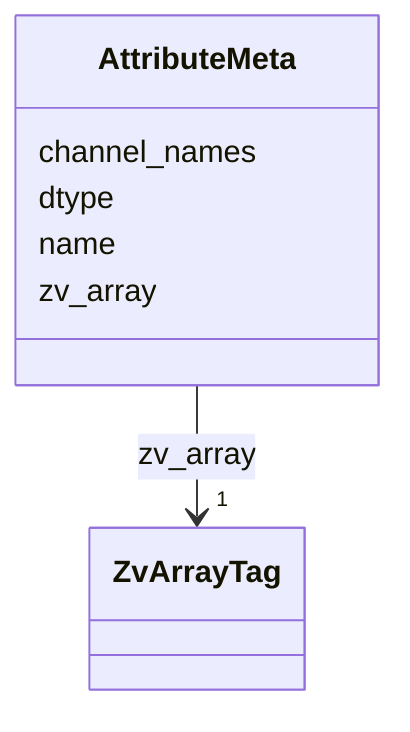


<!-- no inheritance hierarchy -->

## Slots

| Name | Cardinality and Range | Description | Inheritance |
| ---  | --- | --- | --- |
| [zv_array](zv_array.md) | 1 <br/> [ZvArrayTag](ZvArrayTag.md) | Discriminator slot identifying the kind of per-array `` | direct |
| [name](name.md) | 1 <br/> [String](String.md) | NGFF axis or attribute name (e | direct |
| [dtype](dtype.md) | 1 <br/> [String](String.md) | Numpy dtype string of the array's value type (e | direct |
| [channel_names](channel_names.md) | * <br/> [String](String.md) | For multi-channel per-vertex attributes, the channel labels | direct |


## Identifier and Mapping Information


### Schema Source


* from schema: https://w3id.org/zarr-vectors/schema/0.5


## Mappings

| Mapping Type | Mapped Value |
| ---  | ---  |
| self | zv:AttributeMeta |
| native | zv:AttributeMeta |


## LinkML Source

### Direct

<details>
```yaml
name: AttributeMeta
description: '``.zattrs`` for each ``attributes/<name>/`` array.'
from_schema: https://w3id.org/zarr-vectors/schema/0.5
rank: 1000
slots:
- zv_array
- name
- dtype
- channel_names
slot_usage:
  zv_array:
    name: zv_array
    required: true
    equals_string: attribute

```
</details>

### Induced

<details>
```yaml
name: AttributeMeta
description: '``.zattrs`` for each ``attributes/<name>/`` array.'
from_schema: https://w3id.org/zarr-vectors/schema/0.5
rank: 1000
slot_usage:
  zv_array:
    name: zv_array
    required: true
    equals_string: attribute
attributes:
  zv_array:
    name: zv_array
    description: 'Discriminator slot identifying the kind of per-array ``.zattrs``
      block.  Each writer in ``core/arrays.py`` stamps the corresponding token from
      :class:`ZvArrayTag`.

      '
    from_schema: https://w3id.org/zarr-vectors/schema/0.5
    rank: 1000
    alias: zv_array
    owner: AttributeMeta
    domain_of:
    - VerticesMeta
    - LinksMeta
    - AttributeMeta
    - ObjectIndexMeta
    - ObjectIndexPendingMeta
    - ObjectAttributeMeta
    - GroupingsMeta
    - GroupingsAttributeMeta
    - CrossChunkLinksMeta
    - CrossChunkFacesMeta
    - LinkAttributeMeta
    - CrossChunkLinkAttributeMeta
    - MetanodeChildrenMeta
    range: ZvArrayTag
    required: true
    equals_string: attribute
  name:
    name: name
    description: NGFF axis or attribute name (e.g. "x", "intensity").
    from_schema: https://w3id.org/zarr-vectors/schema/0.5
    rank: 1000
    slot_uri: schema:name
    alias: name
    owner: AttributeMeta
    domain_of:
    - Axis
    - AttributeMeta
    - ObjectAttributeMeta
    - GroupingsAttributeMeta
    - LinkAttributeMeta
    - CrossChunkLinkAttributeMeta
    range: string
    required: true
  dtype:
    name: dtype
    description: Numpy dtype string of the array's value type (e.g. "float32").
    from_schema: https://w3id.org/zarr-vectors/schema/0.5
    rank: 1000
    alias: dtype
    owner: AttributeMeta
    domain_of:
    - VerticesMeta
    - LinksMeta
    - AttributeMeta
    - ObjectAttributeMeta
    - GroupingsAttributeMeta
    - LinkAttributeMeta
    - CrossChunkLinkAttributeMeta
    range: string
    required: true
  channel_names:
    name: channel_names
    description: For multi-channel per-vertex attributes, the channel labels.
    from_schema: https://w3id.org/zarr-vectors/schema/0.5
    rank: 1000
    alias: channel_names
    owner: AttributeMeta
    domain_of:
    - AttributeMeta
    range: string
    multivalued: true

```
</details>


---


# Class: Axis 


_One axis of the spatial index.  Mirrors the OME-Zarr NGFF axis object (RFC 4/5)._

__


URI: [ngff:Axis](https://ngff.openmicroscopy.org/0.4/Axis)


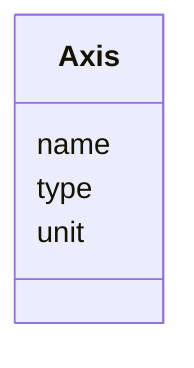


<!-- no inheritance hierarchy -->

## Class Properties

| Property | Value |
| --- | --- |
| Class URI | [ngff:Axis](https://ngff.openmicroscopy.org/0.4/Axis) |


## Slots

| Name | Cardinality and Range | Description | Inheritance |
| ---  | --- | --- | --- |
| [name](name.md) | 1 <br/> [String](String.md) | NGFF axis or attribute name (e | direct |
| [type](type.md) | 1 <br/> [String](String.md) | NGFF axis type — "space", "time", or "channel" | direct |
| [unit](unit.md) | 0..1 <br/> [String](String.md) | NGFF unit string (e | direct |


## Identifier and Mapping Information


### Schema Source


* from schema: https://w3id.org/zarr-vectors/schema/0.5


## Mappings

| Mapping Type | Mapped Value |
| ---  | ---  |
| self | ngff:Axis |
| native | zv:Axis |


## LinkML Source

### Direct

<details>
```yaml
name: Axis
description: 'One axis of the spatial index.  Mirrors the OME-Zarr NGFF axis object
  (RFC 4/5).

  '
from_schema: https://w3id.org/zarr-vectors/schema/0.5
rank: 1000
slots:
- name
- type
- unit
class_uri: ngff:Axis

```
</details>

### Induced

<details>
```yaml
name: Axis
description: 'One axis of the spatial index.  Mirrors the OME-Zarr NGFF axis object
  (RFC 4/5).

  '
from_schema: https://w3id.org/zarr-vectors/schema/0.5
rank: 1000
attributes:
  name:
    name: name
    description: NGFF axis or attribute name (e.g. "x", "intensity").
    from_schema: https://w3id.org/zarr-vectors/schema/0.5
    rank: 1000
    slot_uri: schema:name
    alias: name
    owner: Axis
    domain_of:
    - Axis
    - AttributeMeta
    - ObjectAttributeMeta
    - GroupingsAttributeMeta
    - LinkAttributeMeta
    - CrossChunkLinkAttributeMeta
    range: string
    required: true
  type:
    name: type
    description: NGFF axis type — "space", "time", or "channel".
    from_schema: https://w3id.org/zarr-vectors/schema/0.5
    rank: 1000
    alias: type
    owner: Axis
    domain_of:
    - Axis
    range: string
    required: true
  unit:
    name: unit
    description: NGFF unit string (e.g. "um", "nanometer", "second").
    from_schema: https://w3id.org/zarr-vectors/schema/0.5
    rank: 1000
    alias: unit
    owner: Axis
    domain_of:
    - Axis
    range: string
class_uri: ngff:Axis

```
</details>


---


# Slot: base_bin_shape 


_Supervoxel bin edge lengths at level 0.  When set, every value must be > 0 and ``chunk_shape`` must be an integer multiple along every axis (enforced runtime-side in ``RootMetadata.validate``)._

__


URI: [zv:base_bin_shape](https://w3id.org/zarr-vectors/schema/0.5/base_bin_shape)
Alias: base_bin_shape

<!-- no inheritance hierarchy -->


## Applicable Classes

| Name | Description | Modifies Slot |
| --- | --- | --- |
| [RootMetadata](RootMetadata.md) | Root-level `` |  no  |


## Properties

### Type and Range

| Property | Value |
| --- | --- |
| Range | [Float](Float.md) |
| Domain Of | [RootMetadata](RootMetadata.md) |

### Cardinality and Requirements

| Property | Value |
| --- | --- |
| Multivalued | Yes |


## Identifier and Mapping Information


### Schema Source


* from schema: https://w3id.org/zarr-vectors/schema/0.5


## Mappings

| Mapping Type | Mapped Value |
| ---  | ---  |
| self | zv:base_bin_shape |
| native | zv:base_bin_shape |


## LinkML Source

<details>
```yaml
name: base_bin_shape
description: 'Supervoxel bin edge lengths at level 0.  When set, every value must
  be > 0 and ``chunk_shape`` must be an integer multiple along every axis (enforced
  runtime-side in ``RootMetadata.validate``).

  '
from_schema: https://w3id.org/zarr-vectors/schema/0.5
rank: 1000
alias: base_bin_shape
domain_of:
- RootMetadata
range: float
multivalued: true

```
</details>


---


# Slot: batch_id 


_Monotonic batch id for an ``object_index/pending/<batch>`` sidecar._


URI: [zv:batch_id](https://w3id.org/zarr-vectors/schema/0.5/batch_id)
Alias: batch_id

<!-- no inheritance hierarchy -->


## Applicable Classes

| Name | Description | Modifies Slot |
| --- | --- | --- |
| [ObjectIndexPendingMeta](ObjectIndexPendingMeta.md) | `` |  no  |


## Properties

### Type and Range

| Property | Value |
| --- | --- |
| Range | [Integer](Integer.md) |
| Domain Of | [ObjectIndexPendingMeta](ObjectIndexPendingMeta.md) |

### Cardinality and Requirements

| Property | Value |
| --- | --- |
| Required | Yes |
### Value Constraints

| Property | Value |
| --- | --- |
| Minimum Value | 0 |


## Identifier and Mapping Information


### Schema Source


* from schema: https://w3id.org/zarr-vectors/schema/0.5


## Mappings

| Mapping Type | Mapped Value |
| ---  | ---  |
| self | zv:batch_id |
| native | zv:batch_id |


## LinkML Source

<details>
```yaml
name: batch_id
description: Monotonic batch id for an ``object_index/pending/<batch>`` sidecar.
from_schema: https://w3id.org/zarr-vectors/schema/0.5
rank: 1000
alias: batch_id
domain_of:
- ObjectIndexPendingMeta
range: integer
required: true
minimum_value: 0

```
</details>


---


# Slot: bin_ratio 


_Integer fold-change per axis relative to level 0._


URI: [zv:bin_ratio](https://w3id.org/zarr-vectors/schema/0.5/bin_ratio)
Alias: bin_ratio

<!-- no inheritance hierarchy -->


## Applicable Classes

| Name | Description | Modifies Slot |
| --- | --- | --- |
| [LevelMetadata](LevelMetadata.md) | Per-resolution-level `` |  no  |


## Properties

### Type and Range

| Property | Value |
| --- | --- |
| Range | [Integer](Integer.md) |
| Domain Of | [LevelMetadata](LevelMetadata.md) |

### Cardinality and Requirements

| Property | Value |
| --- | --- |
| Multivalued | Yes |


## Identifier and Mapping Information


### Schema Source


* from schema: https://w3id.org/zarr-vectors/schema/0.5


## Mappings

| Mapping Type | Mapped Value |
| ---  | ---  |
| self | zv:bin_ratio |
| native | zv:bin_ratio |


## LinkML Source

<details>
```yaml
name: bin_ratio
description: Integer fold-change per axis relative to level 0.
from_schema: https://w3id.org/zarr-vectors/schema/0.5
rank: 1000
alias: bin_ratio
domain_of:
- LevelMetadata
range: integer
multivalued: true

```
</details>


---


# Slot: bin_shape 


_Per-axis supervoxel edge lengths at this level.  Must be ``None`` for level 0 (inherits ``base_bin_shape``); must be set for level > 0._

__


URI: [zv:bin_shape](https://w3id.org/zarr-vectors/schema/0.5/bin_shape)
Alias: bin_shape

<!-- no inheritance hierarchy -->


## Applicable Classes

| Name | Description | Modifies Slot |
| --- | --- | --- |
| [LevelMetadata](LevelMetadata.md) | Per-resolution-level `` |  no  |


## Properties

### Type and Range

| Property | Value |
| --- | --- |
| Range | [Float](Float.md) |
| Domain Of | [LevelMetadata](LevelMetadata.md) |

### Cardinality and Requirements

| Property | Value |
| --- | --- |
| Multivalued | Yes |


## Identifier and Mapping Information


### Schema Source


* from schema: https://w3id.org/zarr-vectors/schema/0.5


## Mappings

| Mapping Type | Mapped Value |
| ---  | ---  |
| self | zv:bin_shape |
| native | zv:bin_shape |


## LinkML Source

<details>
```yaml
name: bin_shape
description: 'Per-axis supervoxel edge lengths at this level.  Must be ``None`` for
  level 0 (inherits ``base_bin_shape``); must be set for level > 0.

  '
from_schema: https://w3id.org/zarr-vectors/schema/0.5
rank: 1000
alias: bin_shape
domain_of:
- LevelMetadata
range: float
multivalued: true

```
</details>


---

# Type: Boolean 


_A binary (true or false) value_


URI: [xsd:boolean](http://www.w3.org/2001/XMLSchema#boolean)

## Type Properties

| Property | Value |
| --- | --- |
| Base | `Bool` |
| Type URI | [xsd:boolean](http://www.w3.org/2001/XMLSchema#boolean) |
| Representation | `bool` |


## Notes

* If you are authoring schemas in LinkML YAML, the type is referenced with the lower case "boolean".


## Identifier and Mapping Information


### Schema Source


* from schema: https://w3id.org/zarr-vectors/schema/0.5


## Mappings

| Mapping Type | Mapped Value |
| ---  | ---  |
| self | xsd:boolean |
| native | zv:boolean |
| exact | schema:Boolean |


---


# Class: BoundingBox 


_Two parallel ``ndim``-length arrays representing the global ``(min_corner, max_corner)`` of the store's vertices.  Stored on disk as ``[[min...], [max...]]``; modelled here as a class so cross-field rules can require matching dimensionality._

__


URI: [zv:BoundingBox](https://w3id.org/zarr-vectors/schema/0.5/BoundingBox)


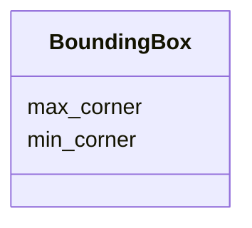


<!-- no inheritance hierarchy -->

## Slots

| Name | Cardinality and Range | Description | Inheritance |
| ---  | --- | --- | --- |
| [min_corner](min_corner.md) | 1..* <br/> [Float](Float.md) | Per-axis minima | direct |
| [max_corner](max_corner.md) | 1..* <br/> [Float](Float.md) | Per-axis maxima | direct |


## Usages

| used by | used in | type | used |
| ---  | --- | --- | --- |
| [RootMetadata](RootMetadata.md) | [bounds](bounds.md) | range | [BoundingBox](BoundingBox.md) |


## Identifier and Mapping Information


### Schema Source


* from schema: https://w3id.org/zarr-vectors/schema/0.5


## Mappings

| Mapping Type | Mapped Value |
| ---  | ---  |
| self | zv:BoundingBox |
| native | zv:BoundingBox |


## LinkML Source

### Direct

<details>
```yaml
name: BoundingBox
description: 'Two parallel ``ndim``-length arrays representing the global ``(min_corner,
  max_corner)`` of the store''s vertices.  Stored on disk as ``[[min...], [max...]]``;
  modelled here as a class so cross-field rules can require matching dimensionality.

  '
from_schema: https://w3id.org/zarr-vectors/schema/0.5
rank: 1000
slots:
- min_corner
- max_corner

```
</details>

### Induced

<details>
```yaml
name: BoundingBox
description: 'Two parallel ``ndim``-length arrays representing the global ``(min_corner,
  max_corner)`` of the store''s vertices.  Stored on disk as ``[[min...], [max...]]``;
  modelled here as a class so cross-field rules can require matching dimensionality.

  '
from_schema: https://w3id.org/zarr-vectors/schema/0.5
rank: 1000
attributes:
  min_corner:
    name: min_corner
    description: Per-axis minima.  Length must equal ``len(spatial_index_dims)``.
    from_schema: https://w3id.org/zarr-vectors/schema/0.5
    rank: 1000
    alias: min_corner
    owner: BoundingBox
    domain_of:
    - BoundingBox
    range: float
    required: true
    multivalued: true
  max_corner:
    name: max_corner
    description: Per-axis maxima.  Length must equal ``len(spatial_index_dims)``.
    from_schema: https://w3id.org/zarr-vectors/schema/0.5
    rank: 1000
    alias: max_corner
    owner: BoundingBox
    domain_of:
    - BoundingBox
    range: float
    required: true
    multivalued: true

```
</details>


---


# Slot: bounds 


_Global vertex bounding box._


URI: [zv:bounds](https://w3id.org/zarr-vectors/schema/0.5/bounds)
Alias: bounds

<!-- no inheritance hierarchy -->


## Applicable Classes

| Name | Description | Modifies Slot |
| --- | --- | --- |
| [RootMetadata](RootMetadata.md) | Root-level `` |  no  |


## Properties

### Type and Range

| Property | Value |
| --- | --- |
| Range | [BoundingBox](BoundingBox.md) |
| Domain Of | [RootMetadata](RootMetadata.md) |

### Cardinality and Requirements

| Property | Value |
| --- | --- |
| Required | Yes |


## Identifier and Mapping Information


### Schema Source


* from schema: https://w3id.org/zarr-vectors/schema/0.5


## Mappings

| Mapping Type | Mapped Value |
| ---  | ---  |
| self | zv:bounds |
| native | zv:bounds |


## LinkML Source

<details>
```yaml
name: bounds
description: Global vertex bounding box.
from_schema: https://w3id.org/zarr-vectors/schema/0.5
rank: 1000
alias: bounds
domain_of:
- RootMetadata
range: BoundingBox
required: true

```
</details>


---


# Slot: channel_names 


_For multi-channel per-vertex attributes, the channel labels._


URI: [zv:channel_names](https://w3id.org/zarr-vectors/schema/0.5/channel_names)
Alias: channel_names

<!-- no inheritance hierarchy -->


## Applicable Classes

| Name | Description | Modifies Slot |
| --- | --- | --- |
| [AttributeMeta](AttributeMeta.md) | `` |  no  |


## Properties

### Type and Range

| Property | Value |
| --- | --- |
| Range | [String](String.md) |
| Domain Of | [AttributeMeta](AttributeMeta.md) |

### Cardinality and Requirements

| Property | Value |
| --- | --- |
| Multivalued | Yes |


## Identifier and Mapping Information


### Schema Source


* from schema: https://w3id.org/zarr-vectors/schema/0.5


## Mappings

| Mapping Type | Mapped Value |
| ---  | ---  |
| self | zv:channel_names |
| native | zv:channel_names |


## LinkML Source

<details>
```yaml
name: channel_names
description: For multi-channel per-vertex attributes, the channel labels.
from_schema: https://w3id.org/zarr-vectors/schema/0.5
rank: 1000
alias: channel_names
domain_of:
- AttributeMeta
range: string
multivalued: true

```
</details>


---


# Slot: chunk_attribute_name 


_Name of the per-vertex attribute used as the leading chunk axis._


URI: [zv:chunk_attribute_name](https://w3id.org/zarr-vectors/schema/0.5/chunk_attribute_name)
Alias: chunk_attribute_name

<!-- no inheritance hierarchy -->


## Applicable Classes

| Name | Description | Modifies Slot |
| --- | --- | --- |
| [LevelMetadata](LevelMetadata.md) | Per-resolution-level `` |  no  |


## Properties

### Type and Range

| Property | Value |
| --- | --- |
| Range | [String](String.md) |
| Domain Of | [LevelMetadata](LevelMetadata.md) |

### Cardinality and Requirements

| Property | Value |
| --- | --- |


## Identifier and Mapping Information


### Schema Source


* from schema: https://w3id.org/zarr-vectors/schema/0.5


## Mappings

| Mapping Type | Mapped Value |
| ---  | ---  |
| self | zv:chunk_attribute_name |
| native | zv:chunk_attribute_name |


## LinkML Source

<details>
```yaml
name: chunk_attribute_name
description: Name of the per-vertex attribute used as the leading chunk axis.
from_schema: https://w3id.org/zarr-vectors/schema/0.5
rank: 1000
alias: chunk_attribute_name
domain_of:
- LevelMetadata
range: string

```
</details>


---


# Slot: chunk_attribute_values 


_Ordered list mapping attribute-bin index to original attribute value.  Must be non-empty when set, and coherent with ``chunk_attribute_name`` (both set or both absent)._

__


URI: [zv:chunk_attribute_values](https://w3id.org/zarr-vectors/schema/0.5/chunk_attribute_values)
Alias: chunk_attribute_values

<!-- no inheritance hierarchy -->


## Applicable Classes

| Name | Description | Modifies Slot |
| --- | --- | --- |
| [LevelMetadata](LevelMetadata.md) | Per-resolution-level `` |  no  |


## Properties

### Type and Range

| Property | Value |
| --- | --- |
| Range | [String](String.md) |
| Domain Of | [LevelMetadata](LevelMetadata.md) |

### Cardinality and Requirements

| Property | Value |
| --- | --- |
| Multivalued | Yes |


## Identifier and Mapping Information


### Schema Source


* from schema: https://w3id.org/zarr-vectors/schema/0.5


## Mappings

| Mapping Type | Mapped Value |
| ---  | ---  |
| self | zv:chunk_attribute_values |
| native | zv:chunk_attribute_values |


## LinkML Source

<details>
```yaml
name: chunk_attribute_values
description: 'Ordered list mapping attribute-bin index to original attribute value.  Must
  be non-empty when set, and coherent with ``chunk_attribute_name`` (both set or both
  absent).

  '
from_schema: https://w3id.org/zarr-vectors/schema/0.5
rank: 1000
alias: chunk_attribute_values
domain_of:
- LevelMetadata
range: string
multivalued: true

```
</details>


---


# Slot: chunk_dims 


_Chunk-key axis names; the leading axis names appear first.  Set when the level uses attribute chunking (e.g. ``["gene", "z", "y", "x"]``)._

__


URI: [zv:chunk_dims](https://w3id.org/zarr-vectors/schema/0.5/chunk_dims)
Alias: chunk_dims

<!-- no inheritance hierarchy -->


## Applicable Classes

| Name | Description | Modifies Slot |
| --- | --- | --- |
| [LevelMetadata](LevelMetadata.md) | Per-resolution-level `` |  no  |


## Properties

### Type and Range

| Property | Value |
| --- | --- |
| Range | [String](String.md) |
| Domain Of | [LevelMetadata](LevelMetadata.md) |

### Cardinality and Requirements

| Property | Value |
| --- | --- |
| Multivalued | Yes |


## Identifier and Mapping Information


### Schema Source


* from schema: https://w3id.org/zarr-vectors/schema/0.5


## Mappings

| Mapping Type | Mapped Value |
| ---  | ---  |
| self | zv:chunk_dims |
| native | zv:chunk_dims |


## LinkML Source

<details>
```yaml
name: chunk_dims
description: 'Chunk-key axis names; the leading axis names appear first.  Set when
  the level uses attribute chunking (e.g. ``["gene", "z", "y", "x"]``).

  '
from_schema: https://w3id.org/zarr-vectors/schema/0.5
rank: 1000
alias: chunk_dims
domain_of:
- LevelMetadata
range: string
multivalued: true

```
</details>


---


# Slot: chunk_shape 


_Physical spatial chunk size per axis (all values > 0)._


URI: [zv:chunk_shape](https://w3id.org/zarr-vectors/schema/0.5/chunk_shape)
Alias: chunk_shape

<!-- no inheritance hierarchy -->


## Applicable Classes

| Name | Description | Modifies Slot |
| --- | --- | --- |
| [RootMetadata](RootMetadata.md) | Root-level `` |  no  |


## Properties

### Type and Range

| Property | Value |
| --- | --- |
| Range | [Float](Float.md) |
| Domain Of | [RootMetadata](RootMetadata.md) |

### Cardinality and Requirements

| Property | Value |
| --- | --- |
| Required | Yes |
| Multivalued | Yes |


## Identifier and Mapping Information


### Schema Source


* from schema: https://w3id.org/zarr-vectors/schema/0.5


## Mappings

| Mapping Type | Mapped Value |
| ---  | ---  |
| self | zv:chunk_shape |
| native | zv:chunk_shape |


## LinkML Source

<details>
```yaml
name: chunk_shape
description: Physical spatial chunk size per axis (all values > 0).
from_schema: https://w3id.org/zarr-vectors/schema/0.5
rank: 1000
alias: chunk_shape
domain_of:
- RootMetadata
range: float
required: true
multivalued: true

```
</details>


---


# Slot: coarsening_method 


_How this level was generated (e.g. "grid_metanode")._


URI: [zv:coarsening_method](https://w3id.org/zarr-vectors/schema/0.5/coarsening_method)
Alias: coarsening_method

<!-- no inheritance hierarchy -->


## Applicable Classes

| Name | Description | Modifies Slot |
| --- | --- | --- |
| [LevelMetadata](LevelMetadata.md) | Per-resolution-level `` |  no  |


## Properties

### Type and Range

| Property | Value |
| --- | --- |
| Range | [String](String.md) |
| Domain Of | [LevelMetadata](LevelMetadata.md) |

### Cardinality and Requirements

| Property | Value |
| --- | --- |


## Identifier and Mapping Information


### Schema Source


* from schema: https://w3id.org/zarr-vectors/schema/0.5


## Mappings

| Mapping Type | Mapped Value |
| ---  | ---  |
| self | zv:coarsening_method |
| native | zv:coarsening_method |


## LinkML Source

<details>
```yaml
name: coarsening_method
description: How this level was generated (e.g. "grid_metanode").
from_schema: https://w3id.org/zarr-vectors/schema/0.5
rank: 1000
alias: coarsening_method
domain_of:
- LevelMetadata
range: string

```
</details>


---


# Slot: cross_chunk_strategy 


URI: [zv:cross_chunk_strategy](https://w3id.org/zarr-vectors/schema/0.5/cross_chunk_strategy)
Alias: cross_chunk_strategy

<!-- no inheritance hierarchy -->


## Applicable Classes

| Name | Description | Modifies Slot |
| --- | --- | --- |
| [RootMetadata](RootMetadata.md) | Root-level `` |  no  |


## Properties

### Type and Range

| Property | Value |
| --- | --- |
| Range | [CrossChunkStrategy](CrossChunkStrategy.md) |
| Domain Of | [RootMetadata](RootMetadata.md) |

### Cardinality and Requirements

| Property | Value |
| --- | --- |


## Identifier and Mapping Information


### Schema Source


* from schema: https://w3id.org/zarr-vectors/schema/0.5


## Mappings

| Mapping Type | Mapped Value |
| ---  | ---  |
| self | zv:cross_chunk_strategy |
| native | zv:cross_chunk_strategy |


## LinkML Source

<details>
```yaml
name: cross_chunk_strategy
from_schema: https://w3id.org/zarr-vectors/schema/0.5
rank: 1000
alias: cross_chunk_strategy
domain_of:
- RootMetadata
range: CrossChunkStrategy

```
</details>


---


# Slot: cross_level_depth 


_Maximum absolute level delta for which cross-pyramid-level link arrays are materialized.  ``0`` = none (no ``+N`` or ``-N`` arrays), ``N`` = generate up to ``±N`` (or ``+N`` only when ``cross_level_storage="implicit"``), ``-1`` = all available pyramid levels.  Default ``1``._

__


URI: [zv:cross_level_depth](https://w3id.org/zarr-vectors/schema/0.5/cross_level_depth)
Alias: cross_level_depth

<!-- no inheritance hierarchy -->


## Applicable Classes

| Name | Description | Modifies Slot |
| --- | --- | --- |
| [RootMetadata](RootMetadata.md) | Root-level `` |  no  |


## Properties

### Type and Range

| Property | Value |
| --- | --- |
| Range | [Integer](Integer.md) |
| Domain Of | [RootMetadata](RootMetadata.md) |

### Cardinality and Requirements

| Property | Value |
| --- | --- |
### Value Constraints

| Property | Value |
| --- | --- |
| Minimum Value | -1 |


## Identifier and Mapping Information


### Schema Source


* from schema: https://w3id.org/zarr-vectors/schema/0.5


## Mappings

| Mapping Type | Mapped Value |
| ---  | ---  |
| self | zv:cross_level_depth |
| native | zv:cross_level_depth |


## LinkML Source

<details>
```yaml
name: cross_level_depth
description: 'Maximum absolute level delta for which cross-pyramid-level link arrays
  are materialized.  ``0`` = none (no ``+N`` or ``-N`` arrays), ``N`` = generate up
  to ``±N`` (or ``+N`` only when ``cross_level_storage="implicit"``), ``-1`` = all
  available pyramid levels.  Default ``1``.

  '
from_schema: https://w3id.org/zarr-vectors/schema/0.5
rank: 1000
alias: cross_level_depth
domain_of:
- RootMetadata
range: integer
minimum_value: -1

```
</details>


---


# Slot: cross_level_storage 


_Whether cross-level link arrays are written in both directions (``explicit``: ``+N`` at the finer level AND ``-N`` at the coarser level) or only positive deltas (``implicit``: only ``+N``, with ``-N`` reconstructed on read).  Default ``explicit``._

__


URI: [zv:cross_level_storage](https://w3id.org/zarr-vectors/schema/0.5/cross_level_storage)
Alias: cross_level_storage

<!-- no inheritance hierarchy -->


## Applicable Classes

| Name | Description | Modifies Slot |
| --- | --- | --- |
| [RootMetadata](RootMetadata.md) | Root-level `` |  no  |


## Properties

### Type and Range

| Property | Value |
| --- | --- |
| Range | [CrossLevelStorage](CrossLevelStorage.md) |
| Domain Of | [RootMetadata](RootMetadata.md) |

### Cardinality and Requirements

| Property | Value |
| --- | --- |


## Identifier and Mapping Information


### Schema Source


* from schema: https://w3id.org/zarr-vectors/schema/0.5


## Mappings

| Mapping Type | Mapped Value |
| ---  | ---  |
| self | zv:cross_level_storage |
| native | zv:cross_level_storage |


## LinkML Source

<details>
```yaml
name: cross_level_storage
description: 'Whether cross-level link arrays are written in both directions (``explicit``:
  ``+N`` at the finer level AND ``-N`` at the coarser level) or only positive deltas
  (``implicit``: only ``+N``, with ``-N`` reconstructed on read).  Default ``explicit``.

  '
from_schema: https://w3id.org/zarr-vectors/schema/0.5
rank: 1000
alias: cross_level_storage
domain_of:
- RootMetadata
range: CrossLevelStorage

```
</details>


---


# Class: CrossChunkFacesMeta 


_``.zattrs`` for ``cross_chunk_faces/`` (0.3 capability ``cross_chunk_faces``)._


URI: [zv:CrossChunkFacesMeta](https://w3id.org/zarr-vectors/schema/0.5/CrossChunkFacesMeta)


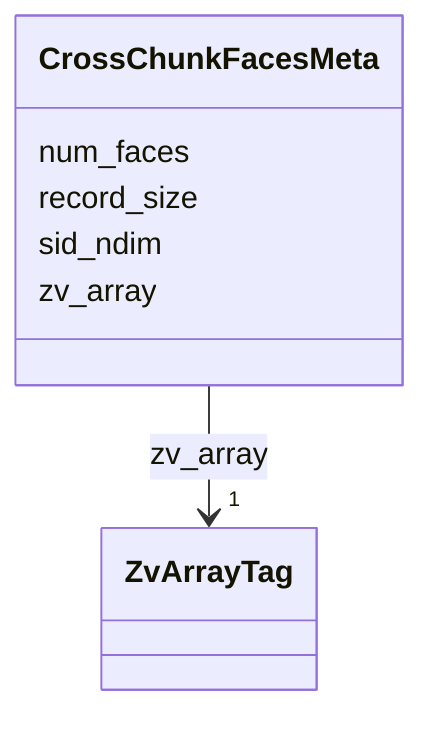


<!-- no inheritance hierarchy -->

## Slots

| Name | Cardinality and Range | Description | Inheritance |
| ---  | --- | --- | --- |
| [zv_array](zv_array.md) | 1 <br/> [ZvArrayTag](ZvArrayTag.md) | Discriminator slot identifying the kind of per-array `` | direct |
| [num_faces](num_faces.md) | 1 <br/> [Integer](Integer.md) | Total cross-chunk face count | direct |
| [sid_ndim](sid_ndim.md) | 1 <br/> [Integer](Integer.md) | Number of spatial-index dimensions encoded in chunk keys | direct |
| [record_size](record_size.md) | 1 <br/> [Integer](Integer.md) | Per-face record width in ``cross_chunk_faces/data`` (sid_ndim + 2 int64s) | direct |


## Identifier and Mapping Information


### Schema Source


* from schema: https://w3id.org/zarr-vectors/schema/0.5


## Mappings

| Mapping Type | Mapped Value |
| ---  | ---  |
| self | zv:CrossChunkFacesMeta |
| native | zv:CrossChunkFacesMeta |


## LinkML Source

### Direct

<details>
```yaml
name: CrossChunkFacesMeta
description: '``.zattrs`` for ``cross_chunk_faces/`` (0.3 capability ``cross_chunk_faces``).'
from_schema: https://w3id.org/zarr-vectors/schema/0.5
rank: 1000
slots:
- zv_array
- num_faces
- sid_ndim
- record_size
slot_usage:
  zv_array:
    name: zv_array
    required: true
    equals_string: cross_chunk_faces

```
</details>

### Induced

<details>
```yaml
name: CrossChunkFacesMeta
description: '``.zattrs`` for ``cross_chunk_faces/`` (0.3 capability ``cross_chunk_faces``).'
from_schema: https://w3id.org/zarr-vectors/schema/0.5
rank: 1000
slot_usage:
  zv_array:
    name: zv_array
    required: true
    equals_string: cross_chunk_faces
attributes:
  zv_array:
    name: zv_array
    description: 'Discriminator slot identifying the kind of per-array ``.zattrs``
      block.  Each writer in ``core/arrays.py`` stamps the corresponding token from
      :class:`ZvArrayTag`.

      '
    from_schema: https://w3id.org/zarr-vectors/schema/0.5
    rank: 1000
    alias: zv_array
    owner: CrossChunkFacesMeta
    domain_of:
    - VerticesMeta
    - LinksMeta
    - AttributeMeta
    - ObjectIndexMeta
    - ObjectIndexPendingMeta
    - ObjectAttributeMeta
    - GroupingsMeta
    - GroupingsAttributeMeta
    - CrossChunkLinksMeta
    - CrossChunkFacesMeta
    - LinkAttributeMeta
    - CrossChunkLinkAttributeMeta
    - MetanodeChildrenMeta
    range: ZvArrayTag
    required: true
    equals_string: cross_chunk_faces
  num_faces:
    name: num_faces
    description: Total cross-chunk face count.
    from_schema: https://w3id.org/zarr-vectors/schema/0.5
    rank: 1000
    alias: num_faces
    owner: CrossChunkFacesMeta
    domain_of:
    - CrossChunkFacesMeta
    range: integer
    required: true
    minimum_value: 0
  sid_ndim:
    name: sid_ndim
    description: Number of spatial-index dimensions encoded in chunk keys.
    from_schema: https://w3id.org/zarr-vectors/schema/0.5
    rank: 1000
    alias: sid_ndim
    owner: CrossChunkFacesMeta
    domain_of:
    - ObjectIndexMeta
    - ObjectIndexPendingMeta
    - CrossChunkLinksMeta
    - CrossChunkFacesMeta
    - MetanodeChildrenMeta
    range: integer
    required: true
    minimum_value: 1
  record_size:
    name: record_size
    description: 'Per-face record width in ``cross_chunk_faces/data`` (sid_ndim +
      2 int64s).

      '
    from_schema: https://w3id.org/zarr-vectors/schema/0.5
    rank: 1000
    alias: record_size
    owner: CrossChunkFacesMeta
    domain_of:
    - CrossChunkFacesMeta
    range: integer
    required: true
    minimum_value: 2

```
</details>


---


# Class: CrossChunkLinkAttributeMeta 


_``.zattrs`` for each ``cross_chunk_link_attributes/<name>/<delta>/`` array.  Stored as a flat blob parallel to the ``data`` blob of the matching ``cross_chunk_links/<delta>/`` array; ``num_links`` MUST equal the parallel CCL array's ``num_links``._

__


URI: [zv:CrossChunkLinkAttributeMeta](https://w3id.org/zarr-vectors/schema/0.5/CrossChunkLinkAttributeMeta)


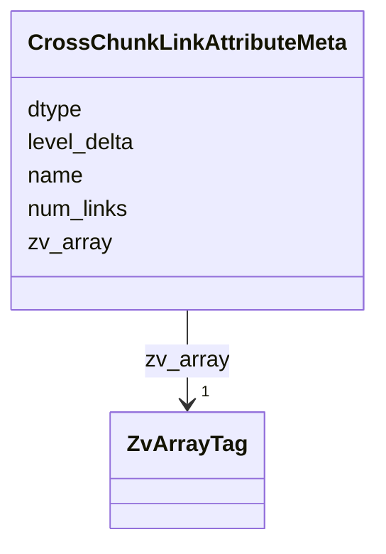


<!-- no inheritance hierarchy -->

## Slots

| Name | Cardinality and Range | Description | Inheritance |
| ---  | --- | --- | --- |
| [zv_array](zv_array.md) | 1 <br/> [ZvArrayTag](ZvArrayTag.md) | Discriminator slot identifying the kind of per-array `` | direct |
| [name](name.md) | 1 <br/> [String](String.md) | NGFF axis or attribute name (e | direct |
| [dtype](dtype.md) | 1 <br/> [String](String.md) | Numpy dtype string of the array's value type (e | direct |
| [level_delta](level_delta.md) | 1 <br/> [Integer](Integer.md) | Pyramid-level delta between the source side (the level that owns this array) ... | direct |
| [num_links](num_links.md) | 1 <br/> [Integer](Integer.md) | Total cross-chunk link count | direct |


## Identifier and Mapping Information


### Schema Source


* from schema: https://w3id.org/zarr-vectors/schema/0.5


## Mappings

| Mapping Type | Mapped Value |
| ---  | ---  |
| self | zv:CrossChunkLinkAttributeMeta |
| native | zv:CrossChunkLinkAttributeMeta |


## LinkML Source

### Direct

<details>
```yaml
name: CrossChunkLinkAttributeMeta
description: '``.zattrs`` for each ``cross_chunk_link_attributes/<name>/<delta>/``
  array.  Stored as a flat blob parallel to the ``data`` blob of the matching ``cross_chunk_links/<delta>/``
  array; ``num_links`` MUST equal the parallel CCL array''s ``num_links``.

  '
from_schema: https://w3id.org/zarr-vectors/schema/0.5
rank: 1000
slots:
- zv_array
- name
- dtype
- level_delta
- num_links
slot_usage:
  zv_array:
    name: zv_array
    required: true
    equals_string: cross_chunk_link_attribute

```
</details>

### Induced

<details>
```yaml
name: CrossChunkLinkAttributeMeta
description: '``.zattrs`` for each ``cross_chunk_link_attributes/<name>/<delta>/``
  array.  Stored as a flat blob parallel to the ``data`` blob of the matching ``cross_chunk_links/<delta>/``
  array; ``num_links`` MUST equal the parallel CCL array''s ``num_links``.

  '
from_schema: https://w3id.org/zarr-vectors/schema/0.5
rank: 1000
slot_usage:
  zv_array:
    name: zv_array
    required: true
    equals_string: cross_chunk_link_attribute
attributes:
  zv_array:
    name: zv_array
    description: 'Discriminator slot identifying the kind of per-array ``.zattrs``
      block.  Each writer in ``core/arrays.py`` stamps the corresponding token from
      :class:`ZvArrayTag`.

      '
    from_schema: https://w3id.org/zarr-vectors/schema/0.5
    rank: 1000
    alias: zv_array
    owner: CrossChunkLinkAttributeMeta
    domain_of:
    - VerticesMeta
    - LinksMeta
    - AttributeMeta
    - ObjectIndexMeta
    - ObjectIndexPendingMeta
    - ObjectAttributeMeta
    - GroupingsMeta
    - GroupingsAttributeMeta
    - CrossChunkLinksMeta
    - CrossChunkFacesMeta
    - LinkAttributeMeta
    - CrossChunkLinkAttributeMeta
    - MetanodeChildrenMeta
    range: ZvArrayTag
    required: true
    equals_string: cross_chunk_link_attribute
  name:
    name: name
    description: NGFF axis or attribute name (e.g. "x", "intensity").
    from_schema: https://w3id.org/zarr-vectors/schema/0.5
    rank: 1000
    slot_uri: schema:name
    alias: name
    owner: CrossChunkLinkAttributeMeta
    domain_of:
    - Axis
    - AttributeMeta
    - ObjectAttributeMeta
    - GroupingsAttributeMeta
    - LinkAttributeMeta
    - CrossChunkLinkAttributeMeta
    range: string
    required: true
  dtype:
    name: dtype
    description: Numpy dtype string of the array's value type (e.g. "float32").
    from_schema: https://w3id.org/zarr-vectors/schema/0.5
    rank: 1000
    alias: dtype
    owner: CrossChunkLinkAttributeMeta
    domain_of:
    - VerticesMeta
    - LinksMeta
    - AttributeMeta
    - ObjectAttributeMeta
    - GroupingsAttributeMeta
    - LinkAttributeMeta
    - CrossChunkLinkAttributeMeta
    range: string
    required: true
  level_delta:
    name: level_delta
    description: 'Pyramid-level delta between the source side (the level that owns
      this array) and the target side of the edges.  ``0`` for intra-level arrays
      (the only kind written pre-0.4), ``+N`` for edges from this level to ``this_level
      + N`` (coarser), ``-N`` for edges to ``this_level - N`` (finer).

      '
    from_schema: https://w3id.org/zarr-vectors/schema/0.5
    rank: 1000
    alias: level_delta
    owner: CrossChunkLinkAttributeMeta
    domain_of:
    - LinksMeta
    - CrossChunkLinksMeta
    - LinkAttributeMeta
    - CrossChunkLinkAttributeMeta
    range: integer
    required: true
  num_links:
    name: num_links
    description: Total cross-chunk link count.
    from_schema: https://w3id.org/zarr-vectors/schema/0.5
    rank: 1000
    alias: num_links
    owner: CrossChunkLinkAttributeMeta
    domain_of:
    - CrossChunkLinksMeta
    - CrossChunkLinkAttributeMeta
    range: integer
    required: true
    minimum_value: 0

```
</details>


---


# Class: CrossChunkLinksMeta 


_``.zattrs`` for a ``cross_chunk_links/<delta>/`` array.  Under the 0.4 multiscale layout, each delta segment carries its own meta block; ``level_delta=0`` is the intra-level array.  Source-side endpoints live at the array's own resolution level; target-side endpoints live at ``this_level + level_delta``._

__


URI: [zv:CrossChunkLinksMeta](https://w3id.org/zarr-vectors/schema/0.5/CrossChunkLinksMeta)


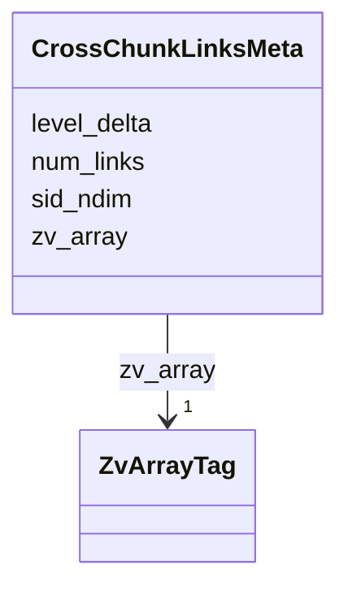


<!-- no inheritance hierarchy -->

## Slots

| Name | Cardinality and Range | Description | Inheritance |
| ---  | --- | --- | --- |
| [zv_array](zv_array.md) | 1 <br/> [ZvArrayTag](ZvArrayTag.md) | Discriminator slot identifying the kind of per-array `` | direct |
| [num_links](num_links.md) | 1 <br/> [Integer](Integer.md) | Total cross-chunk link count | direct |
| [sid_ndim](sid_ndim.md) | 1 <br/> [Integer](Integer.md) | Number of spatial-index dimensions encoded in chunk keys | direct |
| [level_delta](level_delta.md) | 1 <br/> [Integer](Integer.md) | Pyramid-level delta between the source side (the level that owns this array) ... | direct |


## Identifier and Mapping Information


### Schema Source


* from schema: https://w3id.org/zarr-vectors/schema/0.5


## Mappings

| Mapping Type | Mapped Value |
| ---  | ---  |
| self | zv:CrossChunkLinksMeta |
| native | zv:CrossChunkLinksMeta |


## LinkML Source

### Direct

<details>
```yaml
name: CrossChunkLinksMeta
description: '``.zattrs`` for a ``cross_chunk_links/<delta>/`` array.  Under the 0.4
  multiscale layout, each delta segment carries its own meta block; ``level_delta=0``
  is the intra-level array.  Source-side endpoints live at the array''s own resolution
  level; target-side endpoints live at ``this_level + level_delta``.

  '
from_schema: https://w3id.org/zarr-vectors/schema/0.5
rank: 1000
slots:
- zv_array
- num_links
- sid_ndim
- level_delta
slot_usage:
  zv_array:
    name: zv_array
    required: true
    equals_string: cross_chunk_links

```
</details>

### Induced

<details>
```yaml
name: CrossChunkLinksMeta
description: '``.zattrs`` for a ``cross_chunk_links/<delta>/`` array.  Under the 0.4
  multiscale layout, each delta segment carries its own meta block; ``level_delta=0``
  is the intra-level array.  Source-side endpoints live at the array''s own resolution
  level; target-side endpoints live at ``this_level + level_delta``.

  '
from_schema: https://w3id.org/zarr-vectors/schema/0.5
rank: 1000
slot_usage:
  zv_array:
    name: zv_array
    required: true
    equals_string: cross_chunk_links
attributes:
  zv_array:
    name: zv_array
    description: 'Discriminator slot identifying the kind of per-array ``.zattrs``
      block.  Each writer in ``core/arrays.py`` stamps the corresponding token from
      :class:`ZvArrayTag`.

      '
    from_schema: https://w3id.org/zarr-vectors/schema/0.5
    rank: 1000
    alias: zv_array
    owner: CrossChunkLinksMeta
    domain_of:
    - VerticesMeta
    - LinksMeta
    - AttributeMeta
    - ObjectIndexMeta
    - ObjectIndexPendingMeta
    - ObjectAttributeMeta
    - GroupingsMeta
    - GroupingsAttributeMeta
    - CrossChunkLinksMeta
    - CrossChunkFacesMeta
    - LinkAttributeMeta
    - CrossChunkLinkAttributeMeta
    - MetanodeChildrenMeta
    range: ZvArrayTag
    required: true
    equals_string: cross_chunk_links
  num_links:
    name: num_links
    description: Total cross-chunk link count.
    from_schema: https://w3id.org/zarr-vectors/schema/0.5
    rank: 1000
    alias: num_links
    owner: CrossChunkLinksMeta
    domain_of:
    - CrossChunkLinksMeta
    - CrossChunkLinkAttributeMeta
    range: integer
    required: true
    minimum_value: 0
  sid_ndim:
    name: sid_ndim
    description: Number of spatial-index dimensions encoded in chunk keys.
    from_schema: https://w3id.org/zarr-vectors/schema/0.5
    rank: 1000
    alias: sid_ndim
    owner: CrossChunkLinksMeta
    domain_of:
    - ObjectIndexMeta
    - ObjectIndexPendingMeta
    - CrossChunkLinksMeta
    - CrossChunkFacesMeta
    - MetanodeChildrenMeta
    range: integer
    required: true
    minimum_value: 1
  level_delta:
    name: level_delta
    description: 'Pyramid-level delta between the source side (the level that owns
      this array) and the target side of the edges.  ``0`` for intra-level arrays
      (the only kind written pre-0.4), ``+N`` for edges from this level to ``this_level
      + N`` (coarser), ``-N`` for edges to ``this_level - N`` (finer).

      '
    from_schema: https://w3id.org/zarr-vectors/schema/0.5
    rank: 1000
    alias: level_delta
    owner: CrossChunkLinksMeta
    domain_of:
    - LinksMeta
    - CrossChunkLinksMeta
    - LinkAttributeMeta
    - CrossChunkLinkAttributeMeta
    range: integer
    required: true

```
</details>


---

# Enum: CrossChunkStrategy 


_How connectivity that crosses chunk boundaries is represented._


URI: [zv:CrossChunkStrategy](https://w3id.org/zarr-vectors/schema/0.5/CrossChunkStrategy)

## Permissible Values
| Value | Meaning | Description |
| --- | --- | --- |
| boundary_deduplication | None | Vertices on a chunk boundary are duplicated in each chunk |
| explicit_links | None | A ``cross_chunk_links`` array bridges the boundary |
| both | None | Both boundary duplication and explicit links are present |


## Slots

| Name | Description |
| ---  | --- |
| [cross_chunk_strategy](cross_chunk_strategy.md) |  |


## Identifier and Mapping Information


### Schema Source


* from schema: https://w3id.org/zarr-vectors/schema/0.5


## LinkML Source

<details>
```yaml
name: CrossChunkStrategy
description: How connectivity that crosses chunk boundaries is represented.
from_schema: https://w3id.org/zarr-vectors/schema/0.5
rank: 1000
permissible_values:
  boundary_deduplication:
    text: boundary_deduplication
    description: Vertices on a chunk boundary are duplicated in each chunk.
  explicit_links:
    text: explicit_links
    description: A ``cross_chunk_links`` array bridges the boundary.
  both:
    text: both
    description: Both boundary duplication and explicit links are present.

```
</details>


---

# Enum: CrossLevelStorage 


_How cross-pyramid-level edges are stored in the multiscale links layout (``links/<delta>/`` and ``cross_chunk_links/<delta>/``)._

__


URI: [zv:CrossLevelStorage](https://w3id.org/zarr-vectors/schema/0.5/CrossLevelStorage)

## Permissible Values
| Value | Meaning | Description |
| --- | --- | --- |
| none | None | No cross-level link arrays are emitted (``cross_level_depth=0``) |
| implicit | None | Only positive deltas (``+1``, ``+2``,  |
| explicit | None | Both positive and negative deltas are materialized |


## Slots

| Name | Description |
| ---  | --- |
| [cross_level_storage](cross_level_storage.md) | Whether cross-level link arrays are written in both directions (``explicit``:... |


## Identifier and Mapping Information


### Schema Source


* from schema: https://w3id.org/zarr-vectors/schema/0.5


## LinkML Source

<details>
```yaml
name: CrossLevelStorage
description: 'How cross-pyramid-level edges are stored in the multiscale links layout
  (``links/<delta>/`` and ``cross_chunk_links/<delta>/``).

  '
from_schema: https://w3id.org/zarr-vectors/schema/0.5
rank: 1000
permissible_values:
  none:
    text: none
    description: No cross-level link arrays are emitted (``cross_level_depth=0``).
  implicit:
    text: implicit
    description: 'Only positive deltas (``+1``, ``+2``, ...) are materialized at the
      finer level.  Negative-delta edges are reconstructed on read by flipping the
      matching positive-delta array at the coarser level.

      '
  explicit:
    text: explicit
    description: 'Both positive and negative deltas are materialized.  Writes ``+N``
      at the finer level and ``-N`` at the coarser level.

      '

```
</details>


---


# Slot: crs 


_Optional coordinate reference system metadata (free-form dict matching whatever CRS vocabulary the store uses, e.g. WKT, PROJ4, EPSG, CF conventions)._

__


URI: [schema:coordinateReferenceSystem](http://schema.org/coordinateReferenceSystem)
Alias: crs

<!-- no inheritance hierarchy -->


## Applicable Classes

| Name | Description | Modifies Slot |
| --- | --- | --- |
| [RootMetadata](RootMetadata.md) | Root-level `` |  no  |


## Properties

### Type and Range

| Property | Value |
| --- | --- |
| Range | [CRS](CRS.md) |
| Domain Of | [RootMetadata](RootMetadata.md) |
| Slot URI | [schema:coordinateReferenceSystem](http://schema.org/coordinateReferenceSystem) |

### Cardinality and Requirements

| Property | Value |
| --- | --- |


## Identifier and Mapping Information


### Schema Source


* from schema: https://w3id.org/zarr-vectors/schema/0.5


## Mappings

| Mapping Type | Mapped Value |
| ---  | ---  |
| self | schema:coordinateReferenceSystem |
| native | zv:crs |


## LinkML Source

<details>
```yaml
name: crs
description: 'Optional coordinate reference system metadata (free-form dict matching
  whatever CRS vocabulary the store uses, e.g. WKT, PROJ4, EPSG, CF conventions).

  '
from_schema: https://w3id.org/zarr-vectors/schema/0.5
rank: 1000
slot_uri: schema:coordinateReferenceSystem
alias: crs
domain_of:
- RootMetadata
range: CRS
inlined: true

```
</details>


---

# Type: Curie 


_a compact URI_


URI: [xsd:string](http://www.w3.org/2001/XMLSchema#string)

## Type Properties

| Property | Value |
| --- | --- |
| Base | `Curie` |
| Type URI | [xsd:string](http://www.w3.org/2001/XMLSchema#string) |
| Representation | `str` |


## Comments

* in RDF serializations this MUST be expanded to a URI
* in non-RDF serializations MAY be serialized as the compact representation

## Notes

* If you are authoring schemas in LinkML YAML, the type is referenced with the lower case "curie".


## Identifier and Mapping Information


### Schema Source


* from schema: https://w3id.org/zarr-vectors/schema/0.5


## Mappings

| Mapping Type | Mapped Value |
| ---  | ---  |
| self | xsd:string |
| native | zv:curie |


---

# Type: Date 


_a date (year, month and day) in an idealized calendar_


URI: [xsd:date](http://www.w3.org/2001/XMLSchema#date)

## Type Properties

| Property | Value |
| --- | --- |
| Base | `XSDDate` |
| Type URI | [xsd:date](http://www.w3.org/2001/XMLSchema#date) |
| Representation | `str` |


## Notes

* URI is dateTime because OWL reasoners don't work with straight date or time
* If you are authoring schemas in LinkML YAML, the type is referenced with the lower case "date".


## Identifier and Mapping Information


### Schema Source


* from schema: https://w3id.org/zarr-vectors/schema/0.5


## Mappings

| Mapping Type | Mapped Value |
| ---  | ---  |
| self | xsd:date |
| native | zv:date |
| exact | schema:Date |


---

# Type: DateOrDatetime 


_Either a date or a datetime_


URI: [linkml:DateOrDatetime](https://w3id.org/linkml/DateOrDatetime)

## Type Properties

| Property | Value |
| --- | --- |
| Base | `str` |
| Type URI | [linkml:DateOrDatetime](https://w3id.org/linkml/DateOrDatetime) |
| Representation | `str` |


## Notes

* If you are authoring schemas in LinkML YAML, the type is referenced with the lower case "date_or_datetime".


## Identifier and Mapping Information


### Schema Source


* from schema: https://w3id.org/zarr-vectors/schema/0.5


## Mappings

| Mapping Type | Mapped Value |
| ---  | ---  |
| self | linkml:DateOrDatetime |
| native | zv:date_or_datetime |


---

# Type: Datetime 


_The combination of a date and time_


URI: [xsd:dateTime](http://www.w3.org/2001/XMLSchema#dateTime)

## Type Properties

| Property | Value |
| --- | --- |
| Base | `XSDDateTime` |
| Type URI | [xsd:dateTime](http://www.w3.org/2001/XMLSchema#dateTime) |
| Representation | `str` |


## Notes

* If you are authoring schemas in LinkML YAML, the type is referenced with the lower case "datetime".


## Identifier and Mapping Information


### Schema Source


* from schema: https://w3id.org/zarr-vectors/schema/0.5


## Mappings

| Mapping Type | Mapped Value |
| ---  | ---  |
| self | xsd:dateTime |
| native | zv:datetime |
| exact | schema:DateTime |


---

# Type: Decimal 


_A real number with arbitrary precision that conforms to the xsd:decimal specification_


URI: [xsd:decimal](http://www.w3.org/2001/XMLSchema#decimal)

## Type Properties

| Property | Value |
| --- | --- |
| Base | `Decimal` |
| Type URI | [xsd:decimal](http://www.w3.org/2001/XMLSchema#decimal) |


## Notes

* If you are authoring schemas in LinkML YAML, the type is referenced with the lower case "decimal".


## Identifier and Mapping Information


### Schema Source


* from schema: https://w3id.org/zarr-vectors/schema/0.5


## Mappings

| Mapping Type | Mapped Value |
| ---  | ---  |
| self | xsd:decimal |
| native | zv:decimal |
| broad | schema:Number |


---

# Type: Double 


_A real number that conforms to the xsd:double specification_


URI: [xsd:double](http://www.w3.org/2001/XMLSchema#double)

## Type Properties

| Property | Value |
| --- | --- |
| Base | `float` |
| Type URI | [xsd:double](http://www.w3.org/2001/XMLSchema#double) |


## Notes

* If you are authoring schemas in LinkML YAML, the type is referenced with the lower case "double".


## Identifier and Mapping Information


### Schema Source


* from schema: https://w3id.org/zarr-vectors/schema/0.5


## Mappings

| Mapping Type | Mapped Value |
| ---  | ---  |
| self | xsd:double |
| native | zv:double |
| close | schema:Float |


---


# Slot: dtype 


_Numpy dtype string of the array's value type (e.g. "float32")._


URI: [zv:dtype](https://w3id.org/zarr-vectors/schema/0.5/dtype)
Alias: dtype

<!-- no inheritance hierarchy -->


## Applicable Classes

| Name | Description | Modifies Slot |
| --- | --- | --- |
| [LinkAttributeMeta](LinkAttributeMeta.md) | `` |  no  |
| [LinksMeta](LinksMeta.md) | `` |  no  |
| [AttributeMeta](AttributeMeta.md) | `` |  no  |
| [CrossChunkLinkAttributeMeta](CrossChunkLinkAttributeMeta.md) | `` |  no  |
| [ObjectAttributeMeta](ObjectAttributeMeta.md) | `` |  no  |
| [GroupingsAttributeMeta](GroupingsAttributeMeta.md) | `` |  no  |
| [VerticesMeta](VerticesMeta.md) | `` |  no  |


## Properties

### Type and Range

| Property | Value |
| --- | --- |
| Range | [String](String.md) |
| Domain Of | [VerticesMeta](VerticesMeta.md), [LinksMeta](LinksMeta.md), [AttributeMeta](AttributeMeta.md), [ObjectAttributeMeta](ObjectAttributeMeta.md), [GroupingsAttributeMeta](GroupingsAttributeMeta.md), [LinkAttributeMeta](LinkAttributeMeta.md), [CrossChunkLinkAttributeMeta](CrossChunkLinkAttributeMeta.md) |

### Cardinality and Requirements

| Property | Value |
| --- | --- |
| Required | Yes |


## Identifier and Mapping Information


### Schema Source


* from schema: https://w3id.org/zarr-vectors/schema/0.5


## Mappings

| Mapping Type | Mapped Value |
| ---  | ---  |
| self | zv:dtype |
| native | zv:dtype |


## LinkML Source

<details>
```yaml
name: dtype
description: Numpy dtype string of the array's value type (e.g. "float32").
from_schema: https://w3id.org/zarr-vectors/schema/0.5
rank: 1000
alias: dtype
domain_of:
- VerticesMeta
- LinksMeta
- AttributeMeta
- ObjectAttributeMeta
- GroupingsAttributeMeta
- LinkAttributeMeta
- CrossChunkLinkAttributeMeta
range: string
required: true

```
</details>


---

# Enum: Encoding 


_Per-array encoding of vertex data._


URI: [zv:Encoding](https://w3id.org/zarr-vectors/schema/0.5/Encoding)

## Permissible Values
| Value | Meaning | Description |
| --- | --- | --- |
| raw | None | Raw little-endian binary in the dtype's natural layout |
| draco | None | Google Draco mesh / point-cloud compression |


## Slots

| Name | Description |
| ---  | --- |
| [encoding](encoding.md) | How the chunk bytes are encoded |


## Identifier and Mapping Information


### Schema Source


* from schema: https://w3id.org/zarr-vectors/schema/0.5


## LinkML Source

<details>
```yaml
name: Encoding
description: Per-array encoding of vertex data.
from_schema: https://w3id.org/zarr-vectors/schema/0.5
rank: 1000
permissible_values:
  raw:
    text: raw
    description: Raw little-endian binary in the dtype's natural layout.
  draco:
    text: draco
    description: Google Draco mesh / point-cloud compression.

```
</details>


---

# Type: Float 


_A real number that conforms to the xsd:float specification_


URI: [xsd:float](http://www.w3.org/2001/XMLSchema#float)

## Type Properties

| Property | Value |
| --- | --- |
| Base | `float` |
| Type URI | [xsd:float](http://www.w3.org/2001/XMLSchema#float) |


## Notes

* If you are authoring schemas in LinkML YAML, the type is referenced with the lower case "float".


## Identifier and Mapping Information


### Schema Source


* from schema: https://w3id.org/zarr-vectors/schema/0.5


## Mappings

| Mapping Type | Mapped Value |
| ---  | ---  |
| self | xsd:float |
| native | zv:float |
| exact | schema:Float |


---


# Slot: format_capabilities 


_Optional 0.3+ feature tokens advertised by this store._


URI: [zv:format_capabilities](https://w3id.org/zarr-vectors/schema/0.5/format_capabilities)
Alias: format_capabilities

<!-- no inheritance hierarchy -->


## Applicable Classes

| Name | Description | Modifies Slot |
| --- | --- | --- |
| [RootMetadata](RootMetadata.md) | Root-level `` |  no  |


## Properties

### Type and Range

| Property | Value |
| --- | --- |
| Range | [FormatCapability](FormatCapability.md) |
| Domain Of | [RootMetadata](RootMetadata.md) |

### Cardinality and Requirements

| Property | Value |
| --- | --- |
| Multivalued | Yes |


## Identifier and Mapping Information


### Schema Source


* from schema: https://w3id.org/zarr-vectors/schema/0.5


## Mappings

| Mapping Type | Mapped Value |
| ---  | ---  |
| self | zv:format_capabilities |
| native | zv:format_capabilities |


## LinkML Source

<details>
```yaml
name: format_capabilities
description: Optional 0.3+ feature tokens advertised by this store.
from_schema: https://w3id.org/zarr-vectors/schema/0.5
rank: 1000
alias: format_capabilities
domain_of:
- RootMetadata
range: FormatCapability
multivalued: true

```
</details>


---

# Enum: FormatCapability 


_Optional 0.3+ feature tokens a store advertises in :attr:`RootMetadata.format_capabilities`.  Open-set: new tokens will be added in future spec revisions; readers must tolerate unknown values._

__


URI: [zv:FormatCapability](https://w3id.org/zarr-vectors/schema/0.5/FormatCapability)

## Permissible Values
| Value | Meaning | Description |
| --- | --- | --- |
| cross_chunk_faces | None | Store has the ``cross_chunk_faces`` array for boundary faces |
| vertex_count_cache | None | Per-chunk ``vertex_counts/<chunk_key>`` sidecars are present |
| object_index_pending | None | One or more uncompacted ``object_index/pending/<batch>`` sidecars exist |
| preserved_object_ids | None | At least one level was written with ID-preserving sparsification (``LevelMeta... |
| shared_vertex_groups | None | At least one level stores per-chunk vertex groups that may be referenced by m... |
| multiscale_links | None | Store uses the 0 |


## Slots

| Name | Description |
| ---  | --- |
| [format_capabilities](format_capabilities.md) | Optional 0 |


## Identifier and Mapping Information


### Schema Source


* from schema: https://w3id.org/zarr-vectors/schema/0.5


## LinkML Source

<details>
```yaml
name: FormatCapability
description: 'Optional 0.3+ feature tokens a store advertises in :attr:`RootMetadata.format_capabilities`.  Open-set:
  new tokens will be added in future spec revisions; readers must tolerate unknown
  values.

  '
from_schema: https://w3id.org/zarr-vectors/schema/0.5
rank: 1000
permissible_values:
  cross_chunk_faces:
    text: cross_chunk_faces
    description: Store has the ``cross_chunk_faces`` array for boundary faces.
  vertex_count_cache:
    text: vertex_count_cache
    description: Per-chunk ``vertex_counts/<chunk_key>`` sidecars are present.
  object_index_pending:
    text: object_index_pending
    description: One or more uncompacted ``object_index/pending/<batch>`` sidecars
      exist.
  preserved_object_ids:
    text: preserved_object_ids
    description: 'At least one level was written with ID-preserving sparsification
      (``LevelMetadata.preserves_object_ids=True``).  Dropped objects appear as empty
      manifest slots; ``parent_level`` carries semantic weight on those levels.

      '
  shared_vertex_groups:
    text: shared_vertex_groups
    description: 'At least one level stores per-chunk vertex groups that may be referenced
      by multiple objects'' manifests (shared metavertices in the per-object pyramid
      regime).

      '
  multiscale_links:
    text: multiscale_links
    description: 'Store uses the 0.4 multiscale links layout (``links/<delta>/``,
      ``cross_chunk_links/<delta>/``, ``link_attributes/<name>/<delta>/`` and ``cross_chunk_link_attributes/<name>/<delta>/``)
      and may contain cross-pyramid-level edges (``delta != 0``).

      '

```
</details>


---


# Slot: geometry_types 


_One or more geometry kinds present in the store._


URI: [zv:geometry_types](https://w3id.org/zarr-vectors/schema/0.5/geometry_types)
Alias: geometry_types

<!-- no inheritance hierarchy -->


## Applicable Classes

| Name | Description | Modifies Slot |
| --- | --- | --- |
| [RootMetadata](RootMetadata.md) | Root-level `` |  no  |


## Properties

### Type and Range

| Property | Value |
| --- | --- |
| Range | [GeometryType](GeometryType.md) |
| Domain Of | [RootMetadata](RootMetadata.md) |

### Cardinality and Requirements

| Property | Value |
| --- | --- |
| Required | Yes |
| Multivalued | Yes |
| Minimum Cardinality | 1 |


## Identifier and Mapping Information


### Schema Source


* from schema: https://w3id.org/zarr-vectors/schema/0.5


## Mappings

| Mapping Type | Mapped Value |
| ---  | ---  |
| self | zv:geometry_types |
| native | zv:geometry_types |


## LinkML Source

<details>
```yaml
name: geometry_types
description: One or more geometry kinds present in the store.
from_schema: https://w3id.org/zarr-vectors/schema/0.5
rank: 1000
alias: geometry_types
domain_of:
- RootMetadata
range: GeometryType
required: true
multivalued: true
minimum_cardinality: 1

```
</details>


---

# Enum: GeometryType 


_The kind of geometry a store (or one of its sub-types) holds._


URI: [zv:GeometryType](https://w3id.org/zarr-vectors/schema/0.5/GeometryType)

## Permissible Values
| Value | Meaning | Description |
| --- | --- | --- |
| point_cloud | None |  |
| line | None |  |
| polyline | None |  |
| streamline | None |  |
| skeleton | None |  |
| graph | None |  |
| mesh | None |  |


## Slots

| Name | Description |
| ---  | --- |
| [geometry_types](geometry_types.md) | One or more geometry kinds present in the store |


## Identifier and Mapping Information


### Schema Source


* from schema: https://w3id.org/zarr-vectors/schema/0.5


## LinkML Source

<details>
```yaml
name: GeometryType
description: The kind of geometry a store (or one of its sub-types) holds.
from_schema: https://w3id.org/zarr-vectors/schema/0.5
rank: 1000
permissible_values:
  point_cloud:
    text: point_cloud
  line:
    text: line
  polyline:
    text: polyline
  streamline:
    text: streamline
  skeleton:
    text: skeleton
  graph:
    text: graph
  mesh:
    text: mesh

```
</details>


---


# Class: GroupingsAttributeMeta 


_``.zattrs`` for each ``groupings_attributes/<name>/`` array._


URI: [zv:GroupingsAttributeMeta](https://w3id.org/zarr-vectors/schema/0.5/GroupingsAttributeMeta)


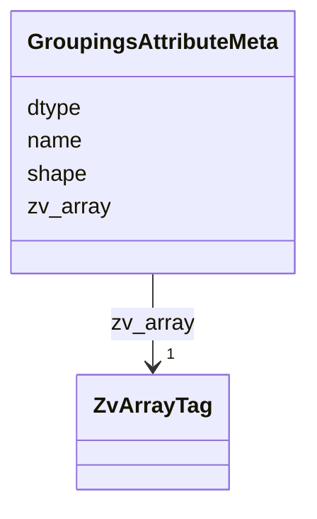


<!-- no inheritance hierarchy -->

## Slots

| Name | Cardinality and Range | Description | Inheritance |
| ---  | --- | --- | --- |
| [zv_array](zv_array.md) | 1 <br/> [ZvArrayTag](ZvArrayTag.md) | Discriminator slot identifying the kind of per-array `` | direct |
| [name](name.md) | 1 <br/> [String](String.md) | NGFF axis or attribute name (e | direct |
| [dtype](dtype.md) | 1 <br/> [String](String.md) | Numpy dtype string of the array's value type (e | direct |
| [shape](shape.md) | 1..* <br/> [Integer](Integer.md) | Shape of a dense per-object/per-group array | direct |


## Identifier and Mapping Information


### Schema Source


* from schema: https://w3id.org/zarr-vectors/schema/0.5


## Mappings

| Mapping Type | Mapped Value |
| ---  | ---  |
| self | zv:GroupingsAttributeMeta |
| native | zv:GroupingsAttributeMeta |


## LinkML Source

### Direct

<details>
```yaml
name: GroupingsAttributeMeta
description: '``.zattrs`` for each ``groupings_attributes/<name>/`` array.'
from_schema: https://w3id.org/zarr-vectors/schema/0.5
rank: 1000
slots:
- zv_array
- name
- dtype
- shape
slot_usage:
  zv_array:
    name: zv_array
    required: true
    equals_string: groupings_attribute

```
</details>

### Induced

<details>
```yaml
name: GroupingsAttributeMeta
description: '``.zattrs`` for each ``groupings_attributes/<name>/`` array.'
from_schema: https://w3id.org/zarr-vectors/schema/0.5
rank: 1000
slot_usage:
  zv_array:
    name: zv_array
    required: true
    equals_string: groupings_attribute
attributes:
  zv_array:
    name: zv_array
    description: 'Discriminator slot identifying the kind of per-array ``.zattrs``
      block.  Each writer in ``core/arrays.py`` stamps the corresponding token from
      :class:`ZvArrayTag`.

      '
    from_schema: https://w3id.org/zarr-vectors/schema/0.5
    rank: 1000
    alias: zv_array
    owner: GroupingsAttributeMeta
    domain_of:
    - VerticesMeta
    - LinksMeta
    - AttributeMeta
    - ObjectIndexMeta
    - ObjectIndexPendingMeta
    - ObjectAttributeMeta
    - GroupingsMeta
    - GroupingsAttributeMeta
    - CrossChunkLinksMeta
    - CrossChunkFacesMeta
    - LinkAttributeMeta
    - CrossChunkLinkAttributeMeta
    - MetanodeChildrenMeta
    range: ZvArrayTag
    required: true
    equals_string: groupings_attribute
  name:
    name: name
    description: NGFF axis or attribute name (e.g. "x", "intensity").
    from_schema: https://w3id.org/zarr-vectors/schema/0.5
    rank: 1000
    slot_uri: schema:name
    alias: name
    owner: GroupingsAttributeMeta
    domain_of:
    - Axis
    - AttributeMeta
    - ObjectAttributeMeta
    - GroupingsAttributeMeta
    - LinkAttributeMeta
    - CrossChunkLinkAttributeMeta
    range: string
    required: true
  dtype:
    name: dtype
    description: Numpy dtype string of the array's value type (e.g. "float32").
    from_schema: https://w3id.org/zarr-vectors/schema/0.5
    rank: 1000
    alias: dtype
    owner: GroupingsAttributeMeta
    domain_of:
    - VerticesMeta
    - LinksMeta
    - AttributeMeta
    - ObjectAttributeMeta
    - GroupingsAttributeMeta
    - LinkAttributeMeta
    - CrossChunkLinkAttributeMeta
    range: string
    required: true
  shape:
    name: shape
    description: Shape of a dense per-object/per-group array.
    from_schema: https://w3id.org/zarr-vectors/schema/0.5
    rank: 1000
    alias: shape
    owner: GroupingsAttributeMeta
    domain_of:
    - ObjectAttributeMeta
    - GroupingsAttributeMeta
    range: integer
    required: true
    multivalued: true

```
</details>


---


# Class: GroupingsMeta 


_``.zattrs`` for ``groupings/``._


URI: [zv:GroupingsMeta](https://w3id.org/zarr-vectors/schema/0.5/GroupingsMeta)


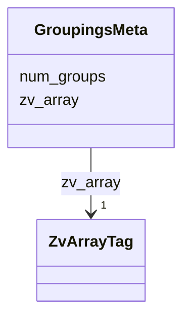


<!-- no inheritance hierarchy -->

## Slots

| Name | Cardinality and Range | Description | Inheritance |
| ---  | --- | --- | --- |
| [zv_array](zv_array.md) | 1 <br/> [ZvArrayTag](ZvArrayTag.md) | Discriminator slot identifying the kind of per-array `` | direct |
| [num_groups](num_groups.md) | 1 <br/> [Integer](Integer.md) | Total grouping count | direct |


## Identifier and Mapping Information


### Schema Source


* from schema: https://w3id.org/zarr-vectors/schema/0.5


## Mappings

| Mapping Type | Mapped Value |
| ---  | ---  |
| self | zv:GroupingsMeta |
| native | zv:GroupingsMeta |


## LinkML Source

### Direct

<details>
```yaml
name: GroupingsMeta
description: '``.zattrs`` for ``groupings/``.'
from_schema: https://w3id.org/zarr-vectors/schema/0.5
rank: 1000
slots:
- zv_array
- num_groups
slot_usage:
  zv_array:
    name: zv_array
    required: true
    equals_string: groupings

```
</details>

### Induced

<details>
```yaml
name: GroupingsMeta
description: '``.zattrs`` for ``groupings/``.'
from_schema: https://w3id.org/zarr-vectors/schema/0.5
rank: 1000
slot_usage:
  zv_array:
    name: zv_array
    required: true
    equals_string: groupings
attributes:
  zv_array:
    name: zv_array
    description: 'Discriminator slot identifying the kind of per-array ``.zattrs``
      block.  Each writer in ``core/arrays.py`` stamps the corresponding token from
      :class:`ZvArrayTag`.

      '
    from_schema: https://w3id.org/zarr-vectors/schema/0.5
    rank: 1000
    alias: zv_array
    owner: GroupingsMeta
    domain_of:
    - VerticesMeta
    - LinksMeta
    - AttributeMeta
    - ObjectIndexMeta
    - ObjectIndexPendingMeta
    - ObjectAttributeMeta
    - GroupingsMeta
    - GroupingsAttributeMeta
    - CrossChunkLinksMeta
    - CrossChunkFacesMeta
    - LinkAttributeMeta
    - CrossChunkLinkAttributeMeta
    - MetanodeChildrenMeta
    range: ZvArrayTag
    required: true
    equals_string: groupings
  num_groups:
    name: num_groups
    description: Total grouping count.
    from_schema: https://w3id.org/zarr-vectors/schema/0.5
    rank: 1000
    alias: num_groups
    owner: GroupingsMeta
    domain_of:
    - GroupingsMeta
    range: integer
    required: true
    minimum_value: 0

```
</details>


---


# Slot: inherited_num_objects 


_OID-space size inherited from the parent level (= ``parent_level.num_objects``).  Required when ``preserves_object_ids`` is true; absent on standalone levels._

__


URI: [zv:inherited_num_objects](https://w3id.org/zarr-vectors/schema/0.5/inherited_num_objects)
Alias: inherited_num_objects

<!-- no inheritance hierarchy -->


## Applicable Classes

| Name | Description | Modifies Slot |
| --- | --- | --- |
| [LevelMetadata](LevelMetadata.md) | Per-resolution-level `` |  no  |


## Properties

### Type and Range

| Property | Value |
| --- | --- |
| Range | [Integer](Integer.md) |
| Domain Of | [LevelMetadata](LevelMetadata.md) |

### Cardinality and Requirements

| Property | Value |
| --- | --- |
### Value Constraints

| Property | Value |
| --- | --- |
| Minimum Value | 0 |


## Identifier and Mapping Information


### Schema Source


* from schema: https://w3id.org/zarr-vectors/schema/0.5


## Mappings

| Mapping Type | Mapped Value |
| ---  | ---  |
| self | zv:inherited_num_objects |
| native | zv:inherited_num_objects |


## LinkML Source

<details>
```yaml
name: inherited_num_objects
description: 'OID-space size inherited from the parent level (= ``parent_level.num_objects``).  Required
  when ``preserves_object_ids`` is true; absent on standalone levels.

  '
from_schema: https://w3id.org/zarr-vectors/schema/0.5
rank: 1000
alias: inherited_num_objects
domain_of:
- LevelMetadata
range: integer
minimum_value: 0

```
</details>


---

# Type: Integer 


_An integer_


URI: [xsd:integer](http://www.w3.org/2001/XMLSchema#integer)

## Type Properties

| Property | Value |
| --- | --- |
| Base | `int` |
| Type URI | [xsd:integer](http://www.w3.org/2001/XMLSchema#integer) |


## Notes

* If you are authoring schemas in LinkML YAML, the type is referenced with the lower case "integer".


## Identifier and Mapping Information


### Schema Source


* from schema: https://w3id.org/zarr-vectors/schema/0.5


## Mappings

| Mapping Type | Mapped Value |
| ---  | ---  |
| self | xsd:integer |
| native | zv:integer |
| exact | schema:Integer |


---

# Type: Jsonpath 


_A string encoding a JSON Path. The value of the string MUST conform to JSON Point syntax and SHOULD dereference to zero or more valid objects within the current instance document when encoded in tree form._


URI: [xsd:string](http://www.w3.org/2001/XMLSchema#string)

## Type Properties

| Property | Value |
| --- | --- |
| Base | `str` |
| Type URI | [xsd:string](http://www.w3.org/2001/XMLSchema#string) |
| Representation | `str` |


## Notes

* If you are authoring schemas in LinkML YAML, the type is referenced with the lower case "jsonpath".


## Identifier and Mapping Information


### Schema Source


* from schema: https://w3id.org/zarr-vectors/schema/0.5


## Mappings

| Mapping Type | Mapped Value |
| ---  | ---  |
| self | xsd:string |
| native | zv:jsonpath |


---

# Type: Jsonpointer 


_A string encoding a JSON Pointer. The value of the string MUST conform to JSON Point syntax and SHOULD dereference to a valid object within the current instance document when encoded in tree form._


URI: [xsd:string](http://www.w3.org/2001/XMLSchema#string)

## Type Properties

| Property | Value |
| --- | --- |
| Base | `str` |
| Type URI | [xsd:string](http://www.w3.org/2001/XMLSchema#string) |
| Representation | `str` |


## Notes

* If you are authoring schemas in LinkML YAML, the type is referenced with the lower case "jsonpointer".


## Identifier and Mapping Information


### Schema Source


* from schema: https://w3id.org/zarr-vectors/schema/0.5


## Mappings

| Mapping Type | Mapped Value |
| ---  | ---  |
| self | xsd:string |
| native | zv:jsonpointer |


---


# Slot: level 


_Resolution level index (0 = full resolution)._


URI: [zv:level](https://w3id.org/zarr-vectors/schema/0.5/level)
Alias: level

<!-- no inheritance hierarchy -->


## Applicable Classes

| Name | Description | Modifies Slot |
| --- | --- | --- |
| [LevelMetadata](LevelMetadata.md) | Per-resolution-level `` |  no  |


## Properties

### Type and Range

| Property | Value |
| --- | --- |
| Range | [Integer](Integer.md) |
| Domain Of | [LevelMetadata](LevelMetadata.md) |

### Cardinality and Requirements

| Property | Value |
| --- | --- |
| Required | Yes |
### Value Constraints

| Property | Value |
| --- | --- |
| Minimum Value | 0 |


## Identifier and Mapping Information


### Schema Source


* from schema: https://w3id.org/zarr-vectors/schema/0.5


## Mappings

| Mapping Type | Mapped Value |
| ---  | ---  |
| self | zv:level |
| native | zv:level |


## LinkML Source

<details>
```yaml
name: level
description: Resolution level index (0 = full resolution).
from_schema: https://w3id.org/zarr-vectors/schema/0.5
rank: 1000
alias: level
domain_of:
- LevelMetadata
range: integer
required: true
minimum_value: 0

```
</details>


---


# Slot: level_delta 


_Pyramid-level delta between the source side (the level that owns this array) and the target side of the edges.  ``0`` for intra-level arrays (the only kind written pre-0.4), ``+N`` for edges from this level to ``this_level + N`` (coarser), ``-N`` for edges to ``this_level - N`` (finer)._

__


URI: [zv:level_delta](https://w3id.org/zarr-vectors/schema/0.5/level_delta)
Alias: level_delta

<!-- no inheritance hierarchy -->


## Applicable Classes

| Name | Description | Modifies Slot |
| --- | --- | --- |
| [LinksMeta](LinksMeta.md) | `` |  no  |
| [LinkAttributeMeta](LinkAttributeMeta.md) | `` |  no  |
| [CrossChunkLinkAttributeMeta](CrossChunkLinkAttributeMeta.md) | `` |  no  |
| [CrossChunkLinksMeta](CrossChunkLinksMeta.md) | `` |  no  |


## Properties

### Type and Range

| Property | Value |
| --- | --- |
| Range | [Integer](Integer.md) |
| Domain Of | [LinksMeta](LinksMeta.md), [CrossChunkLinksMeta](CrossChunkLinksMeta.md), [LinkAttributeMeta](LinkAttributeMeta.md), [CrossChunkLinkAttributeMeta](CrossChunkLinkAttributeMeta.md) |

### Cardinality and Requirements

| Property | Value |
| --- | --- |
| Required | Yes |


## Identifier and Mapping Information


### Schema Source


* from schema: https://w3id.org/zarr-vectors/schema/0.5


## Mappings

| Mapping Type | Mapped Value |
| ---  | ---  |
| self | zv:level_delta |
| native | zv:level_delta |


## LinkML Source

<details>
```yaml
name: level_delta
description: 'Pyramid-level delta between the source side (the level that owns this
  array) and the target side of the edges.  ``0`` for intra-level arrays (the only
  kind written pre-0.4), ``+N`` for edges from this level to ``this_level + N`` (coarser),
  ``-N`` for edges to ``this_level - N`` (finer).

  '
from_schema: https://w3id.org/zarr-vectors/schema/0.5
rank: 1000
alias: level_delta
domain_of:
- LinksMeta
- CrossChunkLinksMeta
- LinkAttributeMeta
- CrossChunkLinkAttributeMeta
range: integer
required: true

```
</details>


---


# Class: LevelMetadata 


_Per-resolution-level ``.zattrs`` payload, persisted under the key ``zarr_vectors_level``.  Validates the runtime :class:`zarr_vectors.core.metadata.LevelMetadata` dataclass._

__


URI: [zv:LevelMetadata](https://w3id.org/zarr-vectors/schema/0.5/LevelMetadata)


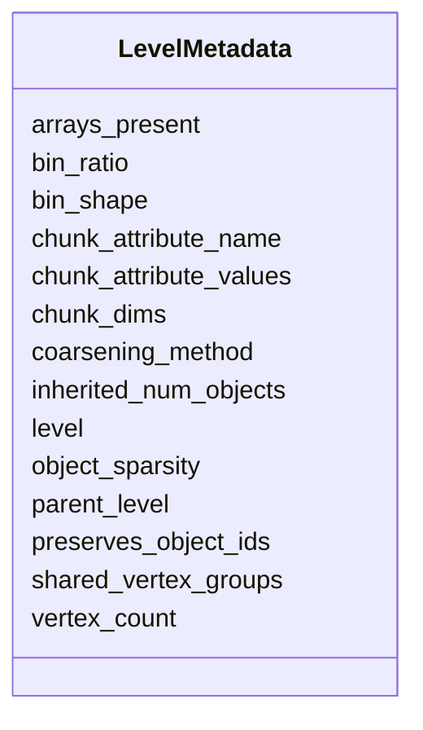


<!-- no inheritance hierarchy -->

## Slots

| Name | Cardinality and Range | Description | Inheritance |
| ---  | --- | --- | --- |
| [level](level.md) | 1 <br/> [Integer](Integer.md) | Resolution level index (0 = full resolution) | direct |
| [vertex_count](vertex_count.md) | 1 <br/> [Integer](Integer.md) | Total number of vertices at this level | direct |
| [arrays_present](arrays_present.md) | 1..* <br/> [String](String.md) | Names of arrays present in the level group | direct |
| [bin_shape](bin_shape.md) | * <br/> [Float](Float.md) | Per-axis supervoxel edge lengths at this level | direct |
| [bin_ratio](bin_ratio.md) | * <br/> [Integer](Integer.md) | Integer fold-change per axis relative to level 0 | direct |
| [object_sparsity](object_sparsity.md) | 0..1 <br/> [Float](Float.md) | Fraction of objects retained at this level | direct |
| [coarsening_method](coarsening_method.md) | 0..1 <br/> [String](String.md) | How this level was generated (e | direct |
| [parent_level](parent_level.md) | 0..1 <br/> [Integer](Integer.md) | Source level index (None for level 0) | direct |
| [chunk_dims](chunk_dims.md) | * <br/> [String](String.md) | Chunk-key axis names; the leading axis names appear first | direct |
| [chunk_attribute_name](chunk_attribute_name.md) | 0..1 <br/> [String](String.md) | Name of the per-vertex attribute used as the leading chunk axis | direct |
| [chunk_attribute_values](chunk_attribute_values.md) | * <br/> [String](String.md) | Ordered list mapping attribute-bin index to original attribute value | direct |
| [preserves_object_ids](preserves_object_ids.md) | 0..1 <br/> [Boolean](Boolean.md) | True for levels written by the per-object pyramid regime | direct |
| [inherited_num_objects](inherited_num_objects.md) | 0..1 <br/> [Integer](Integer.md) | OID-space size inherited from the parent level (= ``parent_level | direct |
| [shared_vertex_groups](shared_vertex_groups.md) | 0..1 <br/> [Boolean](Boolean.md) | True when per-chunk vertex groups may be referenced by multiple objects' mani... | direct |


## Identifier and Mapping Information


### Schema Source


* from schema: https://w3id.org/zarr-vectors/schema/0.5


## Mappings

| Mapping Type | Mapped Value |
| ---  | ---  |
| self | zv:LevelMetadata |
| native | zv:LevelMetadata |


## LinkML Source

### Direct

<details>
```yaml
name: LevelMetadata
description: 'Per-resolution-level ``.zattrs`` payload, persisted under the key ``zarr_vectors_level``.  Validates
  the runtime :class:`zarr_vectors.core.metadata.LevelMetadata` dataclass.

  '
from_schema: https://w3id.org/zarr-vectors/schema/0.5
rank: 1000
slots:
- level
- vertex_count
- arrays_present
- bin_shape
- bin_ratio
- object_sparsity
- coarsening_method
- parent_level
- chunk_dims
- chunk_attribute_name
- chunk_attribute_values
- preserves_object_ids
- inherited_num_objects
- shared_vertex_groups

```
</details>

### Induced

<details>
```yaml
name: LevelMetadata
description: 'Per-resolution-level ``.zattrs`` payload, persisted under the key ``zarr_vectors_level``.  Validates
  the runtime :class:`zarr_vectors.core.metadata.LevelMetadata` dataclass.

  '
from_schema: https://w3id.org/zarr-vectors/schema/0.5
rank: 1000
attributes:
  level:
    name: level
    description: Resolution level index (0 = full resolution).
    from_schema: https://w3id.org/zarr-vectors/schema/0.5
    rank: 1000
    alias: level
    owner: LevelMetadata
    domain_of:
    - LevelMetadata
    range: integer
    required: true
    minimum_value: 0
  vertex_count:
    name: vertex_count
    description: Total number of vertices at this level.
    from_schema: https://w3id.org/zarr-vectors/schema/0.5
    rank: 1000
    alias: vertex_count
    owner: LevelMetadata
    domain_of:
    - LevelMetadata
    range: integer
    required: true
    minimum_value: 0
  arrays_present:
    name: arrays_present
    description: Names of arrays present in the level group.
    from_schema: https://w3id.org/zarr-vectors/schema/0.5
    rank: 1000
    alias: arrays_present
    owner: LevelMetadata
    domain_of:
    - LevelMetadata
    range: string
    required: true
    multivalued: true
  bin_shape:
    name: bin_shape
    description: 'Per-axis supervoxel edge lengths at this level.  Must be ``None``
      for level 0 (inherits ``base_bin_shape``); must be set for level > 0.

      '
    from_schema: https://w3id.org/zarr-vectors/schema/0.5
    rank: 1000
    alias: bin_shape
    owner: LevelMetadata
    domain_of:
    - LevelMetadata
    range: float
    multivalued: true
  bin_ratio:
    name: bin_ratio
    description: Integer fold-change per axis relative to level 0.
    from_schema: https://w3id.org/zarr-vectors/schema/0.5
    rank: 1000
    alias: bin_ratio
    owner: LevelMetadata
    domain_of:
    - LevelMetadata
    range: integer
    multivalued: true
  object_sparsity:
    name: object_sparsity
    description: Fraction of objects retained at this level.
    from_schema: https://w3id.org/zarr-vectors/schema/0.5
    rank: 1000
    alias: object_sparsity
    owner: LevelMetadata
    domain_of:
    - LevelMetadata
    range: float
    minimum_value: 0.0
    maximum_value: 1.0
  coarsening_method:
    name: coarsening_method
    description: How this level was generated (e.g. "grid_metanode").
    from_schema: https://w3id.org/zarr-vectors/schema/0.5
    rank: 1000
    alias: coarsening_method
    owner: LevelMetadata
    domain_of:
    - LevelMetadata
    range: string
  parent_level:
    name: parent_level
    description: Source level index (None for level 0).
    from_schema: https://w3id.org/zarr-vectors/schema/0.5
    rank: 1000
    alias: parent_level
    owner: LevelMetadata
    domain_of:
    - LevelMetadata
    range: integer
    minimum_value: 0
  chunk_dims:
    name: chunk_dims
    description: 'Chunk-key axis names; the leading axis names appear first.  Set
      when the level uses attribute chunking (e.g. ``["gene", "z", "y", "x"]``).

      '
    from_schema: https://w3id.org/zarr-vectors/schema/0.5
    rank: 1000
    alias: chunk_dims
    owner: LevelMetadata
    domain_of:
    - LevelMetadata
    range: string
    multivalued: true
  chunk_attribute_name:
    name: chunk_attribute_name
    description: Name of the per-vertex attribute used as the leading chunk axis.
    from_schema: https://w3id.org/zarr-vectors/schema/0.5
    rank: 1000
    alias: chunk_attribute_name
    owner: LevelMetadata
    domain_of:
    - LevelMetadata
    range: string
  chunk_attribute_values:
    name: chunk_attribute_values
    description: 'Ordered list mapping attribute-bin index to original attribute value.  Must
      be non-empty when set, and coherent with ``chunk_attribute_name`` (both set
      or both absent).

      '
    from_schema: https://w3id.org/zarr-vectors/schema/0.5
    rank: 1000
    alias: chunk_attribute_values
    owner: LevelMetadata
    domain_of:
    - LevelMetadata
    range: string
    multivalued: true
  preserves_object_ids:
    name: preserves_object_ids
    description: 'True for levels written by the per-object pyramid regime.  When
      set, ``num_objects`` and ``object_attributes`` row count inherit from the parent
      level''s OID space; dropped objects leave empty manifest slots and zero ``present_mask``
      bytes.  ``parent_level`` is load-bearing under this flag.

      '
    from_schema: https://w3id.org/zarr-vectors/schema/0.5
    rank: 1000
    alias: preserves_object_ids
    owner: LevelMetadata
    domain_of:
    - LevelMetadata
    range: boolean
  inherited_num_objects:
    name: inherited_num_objects
    description: 'OID-space size inherited from the parent level (= ``parent_level.num_objects``).  Required
      when ``preserves_object_ids`` is true; absent on standalone levels.

      '
    from_schema: https://w3id.org/zarr-vectors/schema/0.5
    rank: 1000
    alias: inherited_num_objects
    owner: LevelMetadata
    domain_of:
    - LevelMetadata
    range: integer
    minimum_value: 0
  shared_vertex_groups:
    name: shared_vertex_groups
    description: 'True when per-chunk vertex groups may be referenced by multiple
      objects'' manifests (shared metavertices in the per-object pyramid regime).  Readers
      MAY use this to short-circuit dedup work.

      '
    from_schema: https://w3id.org/zarr-vectors/schema/0.5
    rank: 1000
    alias: shared_vertex_groups
    owner: LevelMetadata
    domain_of:
    - LevelMetadata
    range: boolean

```
</details>


---


# Slot: link_width 


_Width of a links row (2 for edges, 3 or 4 for face rows)._


URI: [zv:link_width](https://w3id.org/zarr-vectors/schema/0.5/link_width)
Alias: link_width

<!-- no inheritance hierarchy -->


## Applicable Classes

| Name | Description | Modifies Slot |
| --- | --- | --- |
| [LinksMeta](LinksMeta.md) | `` |  no  |


## Properties

### Type and Range

| Property | Value |
| --- | --- |
| Range | [Integer](Integer.md) |
| Domain Of | [LinksMeta](LinksMeta.md) |

### Cardinality and Requirements

| Property | Value |
| --- | --- |
| Required | Yes |
### Value Constraints

| Property | Value |
| --- | --- |
| Minimum Value | 2 |


## Identifier and Mapping Information


### Schema Source


* from schema: https://w3id.org/zarr-vectors/schema/0.5


## Mappings

| Mapping Type | Mapped Value |
| ---  | ---  |
| self | zv:link_width |
| native | zv:link_width |


## LinkML Source

<details>
```yaml
name: link_width
description: Width of a links row (2 for edges, 3 or 4 for face rows).
from_schema: https://w3id.org/zarr-vectors/schema/0.5
rank: 1000
alias: link_width
domain_of:
- LinksMeta
range: integer
required: true
minimum_value: 2

```
</details>


---


# Class: LinkAttributeMeta 


_``.zattrs`` for each ``link_attributes/<name>/<delta>/`` array. Parallel to the ``links/<delta>/`` array of the same ``<delta>``._

__


URI: [zv:LinkAttributeMeta](https://w3id.org/zarr-vectors/schema/0.5/LinkAttributeMeta)


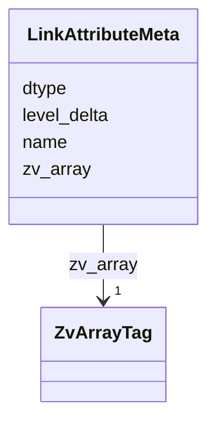


<!-- no inheritance hierarchy -->

## Slots

| Name | Cardinality and Range | Description | Inheritance |
| ---  | --- | --- | --- |
| [zv_array](zv_array.md) | 1 <br/> [ZvArrayTag](ZvArrayTag.md) | Discriminator slot identifying the kind of per-array `` | direct |
| [name](name.md) | 1 <br/> [String](String.md) | NGFF axis or attribute name (e | direct |
| [dtype](dtype.md) | 1 <br/> [String](String.md) | Numpy dtype string of the array's value type (e | direct |
| [level_delta](level_delta.md) | 1 <br/> [Integer](Integer.md) | Pyramid-level delta between the source side (the level that owns this array) ... | direct |


## Identifier and Mapping Information


### Schema Source


* from schema: https://w3id.org/zarr-vectors/schema/0.5


## Mappings

| Mapping Type | Mapped Value |
| ---  | ---  |
| self | zv:LinkAttributeMeta |
| native | zv:LinkAttributeMeta |


## LinkML Source

### Direct

<details>
```yaml
name: LinkAttributeMeta
description: '``.zattrs`` for each ``link_attributes/<name>/<delta>/`` array. Parallel
  to the ``links/<delta>/`` array of the same ``<delta>``.

  '
from_schema: https://w3id.org/zarr-vectors/schema/0.5
rank: 1000
slots:
- zv_array
- name
- dtype
- level_delta
slot_usage:
  zv_array:
    name: zv_array
    required: true
    equals_string: link_attribute

```
</details>

### Induced

<details>
```yaml
name: LinkAttributeMeta
description: '``.zattrs`` for each ``link_attributes/<name>/<delta>/`` array. Parallel
  to the ``links/<delta>/`` array of the same ``<delta>``.

  '
from_schema: https://w3id.org/zarr-vectors/schema/0.5
rank: 1000
slot_usage:
  zv_array:
    name: zv_array
    required: true
    equals_string: link_attribute
attributes:
  zv_array:
    name: zv_array
    description: 'Discriminator slot identifying the kind of per-array ``.zattrs``
      block.  Each writer in ``core/arrays.py`` stamps the corresponding token from
      :class:`ZvArrayTag`.

      '
    from_schema: https://w3id.org/zarr-vectors/schema/0.5
    rank: 1000
    alias: zv_array
    owner: LinkAttributeMeta
    domain_of:
    - VerticesMeta
    - LinksMeta
    - AttributeMeta
    - ObjectIndexMeta
    - ObjectIndexPendingMeta
    - ObjectAttributeMeta
    - GroupingsMeta
    - GroupingsAttributeMeta
    - CrossChunkLinksMeta
    - CrossChunkFacesMeta
    - LinkAttributeMeta
    - CrossChunkLinkAttributeMeta
    - MetanodeChildrenMeta
    range: ZvArrayTag
    required: true
    equals_string: link_attribute
  name:
    name: name
    description: NGFF axis or attribute name (e.g. "x", "intensity").
    from_schema: https://w3id.org/zarr-vectors/schema/0.5
    rank: 1000
    slot_uri: schema:name
    alias: name
    owner: LinkAttributeMeta
    domain_of:
    - Axis
    - AttributeMeta
    - ObjectAttributeMeta
    - GroupingsAttributeMeta
    - LinkAttributeMeta
    - CrossChunkLinkAttributeMeta
    range: string
    required: true
  dtype:
    name: dtype
    description: Numpy dtype string of the array's value type (e.g. "float32").
    from_schema: https://w3id.org/zarr-vectors/schema/0.5
    rank: 1000
    alias: dtype
    owner: LinkAttributeMeta
    domain_of:
    - VerticesMeta
    - LinksMeta
    - AttributeMeta
    - ObjectAttributeMeta
    - GroupingsAttributeMeta
    - LinkAttributeMeta
    - CrossChunkLinkAttributeMeta
    range: string
    required: true
  level_delta:
    name: level_delta
    description: 'Pyramid-level delta between the source side (the level that owns
      this array) and the target side of the edges.  ``0`` for intra-level arrays
      (the only kind written pre-0.4), ``+N`` for edges from this level to ``this_level
      + N`` (coarser), ``-N`` for edges to ``this_level - N`` (finer).

      '
    from_schema: https://w3id.org/zarr-vectors/schema/0.5
    rank: 1000
    alias: level_delta
    owner: LinkAttributeMeta
    domain_of:
    - LinksMeta
    - CrossChunkLinksMeta
    - LinkAttributeMeta
    - CrossChunkLinkAttributeMeta
    range: integer
    required: true

```
</details>


---


# Slot: links_convention 


URI: [zv:links_convention](https://w3id.org/zarr-vectors/schema/0.5/links_convention)
Alias: links_convention

<!-- no inheritance hierarchy -->


## Applicable Classes

| Name | Description | Modifies Slot |
| --- | --- | --- |
| [RootMetadata](RootMetadata.md) | Root-level `` |  no  |


## Properties

### Type and Range

| Property | Value |
| --- | --- |
| Range | [LinksConvention](LinksConvention.md) |
| Domain Of | [RootMetadata](RootMetadata.md) |

### Cardinality and Requirements

| Property | Value |
| --- | --- |


## Identifier and Mapping Information


### Schema Source


* from schema: https://w3id.org/zarr-vectors/schema/0.5


## Mappings

| Mapping Type | Mapped Value |
| ---  | ---  |
| self | zv:links_convention |
| native | zv:links_convention |


## LinkML Source

<details>
```yaml
name: links_convention
from_schema: https://w3id.org/zarr-vectors/schema/0.5
rank: 1000
alias: links_convention
domain_of:
- RootMetadata
range: LinksConvention

```
</details>


---

# Enum: LinksConvention 


_How intra-chunk links are represented for a polyline/graph/mesh._

__


URI: [zv:LinksConvention](https://w3id.org/zarr-vectors/schema/0.5/LinksConvention)

## Permissible Values
| Value | Meaning | Description |
| --- | --- | --- |
| explicit | None | An explicit per-chunk ``links/<chunk_key>`` array is written |
| implicit_sequential | None | Vertex ordering encodes the polyline; no links array |
| implicit_sequential_with_branches | None | Skeleton convention — implicit sequential plus branch list |


## Slots

| Name | Description |
| ---  | --- |
| [links_convention](links_convention.md) |  |


## Identifier and Mapping Information


### Schema Source


* from schema: https://w3id.org/zarr-vectors/schema/0.5


## LinkML Source

<details>
```yaml
name: LinksConvention
description: 'How intra-chunk links are represented for a polyline/graph/mesh.

  '
from_schema: https://w3id.org/zarr-vectors/schema/0.5
rank: 1000
permissible_values:
  explicit:
    text: explicit
    description: An explicit per-chunk ``links/<chunk_key>`` array is written.
  implicit_sequential:
    text: implicit_sequential
    description: Vertex ordering encodes the polyline; no links array.
  implicit_sequential_with_branches:
    text: implicit_sequential_with_branches
    description: Skeleton convention — implicit sequential plus branch list.

```
</details>


---


# Class: LinksMeta 


_``.zattrs`` for a ``links/<delta>/`` array.  Under the 0.4 multiscale layout, each delta segment carries its own meta block; ``level_delta=0`` is the intra-level array (the only one written pre-0.4)._

__


URI: [zv:LinksMeta](https://w3id.org/zarr-vectors/schema/0.5/LinksMeta)


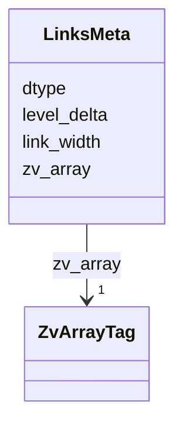


<!-- no inheritance hierarchy -->

## Slots

| Name | Cardinality and Range | Description | Inheritance |
| ---  | --- | --- | --- |
| [zv_array](zv_array.md) | 1 <br/> [ZvArrayTag](ZvArrayTag.md) | Discriminator slot identifying the kind of per-array `` | direct |
| [dtype](dtype.md) | 1 <br/> [String](String.md) | Numpy dtype string of the array's value type (e | direct |
| [link_width](link_width.md) | 1 <br/> [Integer](Integer.md) | Width of a links row (2 for edges, 3 or 4 for face rows) | direct |
| [level_delta](level_delta.md) | 1 <br/> [Integer](Integer.md) | Pyramid-level delta between the source side (the level that owns this array) ... | direct |


## Identifier and Mapping Information


### Schema Source


* from schema: https://w3id.org/zarr-vectors/schema/0.5


## Mappings

| Mapping Type | Mapped Value |
| ---  | ---  |
| self | zv:LinksMeta |
| native | zv:LinksMeta |


## LinkML Source

### Direct

<details>
```yaml
name: LinksMeta
description: '``.zattrs`` for a ``links/<delta>/`` array.  Under the 0.4 multiscale
  layout, each delta segment carries its own meta block; ``level_delta=0`` is the
  intra-level array (the only one written pre-0.4).

  '
from_schema: https://w3id.org/zarr-vectors/schema/0.5
rank: 1000
slots:
- zv_array
- dtype
- link_width
- level_delta
slot_usage:
  zv_array:
    name: zv_array
    required: true
    equals_string: links

```
</details>

### Induced

<details>
```yaml
name: LinksMeta
description: '``.zattrs`` for a ``links/<delta>/`` array.  Under the 0.4 multiscale
  layout, each delta segment carries its own meta block; ``level_delta=0`` is the
  intra-level array (the only one written pre-0.4).

  '
from_schema: https://w3id.org/zarr-vectors/schema/0.5
rank: 1000
slot_usage:
  zv_array:
    name: zv_array
    required: true
    equals_string: links
attributes:
  zv_array:
    name: zv_array
    description: 'Discriminator slot identifying the kind of per-array ``.zattrs``
      block.  Each writer in ``core/arrays.py`` stamps the corresponding token from
      :class:`ZvArrayTag`.

      '
    from_schema: https://w3id.org/zarr-vectors/schema/0.5
    rank: 1000
    alias: zv_array
    owner: LinksMeta
    domain_of:
    - VerticesMeta
    - LinksMeta
    - AttributeMeta
    - ObjectIndexMeta
    - ObjectIndexPendingMeta
    - ObjectAttributeMeta
    - GroupingsMeta
    - GroupingsAttributeMeta
    - CrossChunkLinksMeta
    - CrossChunkFacesMeta
    - LinkAttributeMeta
    - CrossChunkLinkAttributeMeta
    - MetanodeChildrenMeta
    range: ZvArrayTag
    required: true
    equals_string: links
  dtype:
    name: dtype
    description: Numpy dtype string of the array's value type (e.g. "float32").
    from_schema: https://w3id.org/zarr-vectors/schema/0.5
    rank: 1000
    alias: dtype
    owner: LinksMeta
    domain_of:
    - VerticesMeta
    - LinksMeta
    - AttributeMeta
    - ObjectAttributeMeta
    - GroupingsAttributeMeta
    - LinkAttributeMeta
    - CrossChunkLinkAttributeMeta
    range: string
    required: true
  link_width:
    name: link_width
    description: Width of a links row (2 for edges, 3 or 4 for face rows).
    from_schema: https://w3id.org/zarr-vectors/schema/0.5
    rank: 1000
    alias: link_width
    owner: LinksMeta
    domain_of:
    - LinksMeta
    range: integer
    required: true
    minimum_value: 2
  level_delta:
    name: level_delta
    description: 'Pyramid-level delta between the source side (the level that owns
      this array) and the target side of the edges.  ``0`` for intra-level arrays
      (the only kind written pre-0.4), ``+N`` for edges from this level to ``this_level
      + N`` (coarser), ``-N`` for edges to ``this_level - N`` (finer).

      '
    from_schema: https://w3id.org/zarr-vectors/schema/0.5
    rank: 1000
    alias: level_delta
    owner: LinksMeta
    domain_of:
    - LinksMeta
    - CrossChunkLinksMeta
    - LinkAttributeMeta
    - CrossChunkLinkAttributeMeta
    range: integer
    required: true

```
</details>


---


# Slot: max_corner 


_Per-axis maxima.  Length must equal ``len(spatial_index_dims)``._


URI: [zv:max_corner](https://w3id.org/zarr-vectors/schema/0.5/max_corner)
Alias: max_corner

<!-- no inheritance hierarchy -->


## Applicable Classes

| Name | Description | Modifies Slot |
| --- | --- | --- |
| [BoundingBox](BoundingBox.md) | Two parallel ``ndim``-length arrays representing the global ``(min_corner, ma... |  no  |


## Properties

### Type and Range

| Property | Value |
| --- | --- |
| Range | [Float](Float.md) |
| Domain Of | [BoundingBox](BoundingBox.md) |

### Cardinality and Requirements

| Property | Value |
| --- | --- |
| Required | Yes |
| Multivalued | Yes |


## Identifier and Mapping Information


### Schema Source


* from schema: https://w3id.org/zarr-vectors/schema/0.5


## Mappings

| Mapping Type | Mapped Value |
| ---  | ---  |
| self | zv:max_corner |
| native | zv:max_corner |


## LinkML Source

<details>
```yaml
name: max_corner
description: Per-axis maxima.  Length must equal ``len(spatial_index_dims)``.
from_schema: https://w3id.org/zarr-vectors/schema/0.5
rank: 1000
alias: max_corner
domain_of:
- BoundingBox
range: float
required: true
multivalued: true

```
</details>


---


# Class: MetanodeChildrenMeta 


_``.zattrs`` for the ``metanode_children/`` coarsening sidecar._


URI: [zv:MetanodeChildrenMeta](https://w3id.org/zarr-vectors/schema/0.5/MetanodeChildrenMeta)


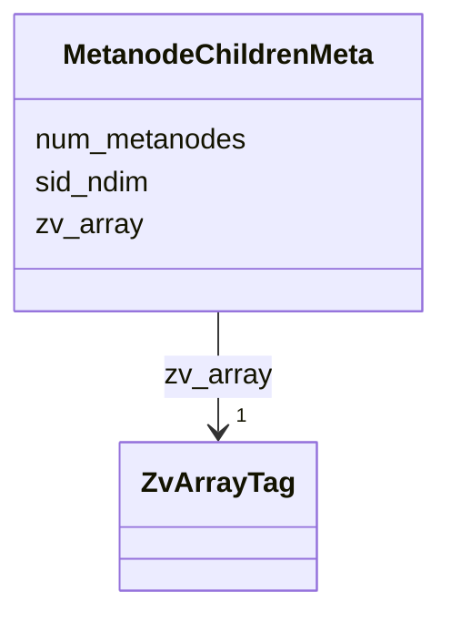


<!-- no inheritance hierarchy -->

## Slots

| Name | Cardinality and Range | Description | Inheritance |
| ---  | --- | --- | --- |
| [zv_array](zv_array.md) | 1 <br/> [ZvArrayTag](ZvArrayTag.md) | Discriminator slot identifying the kind of per-array `` | direct |
| [num_metanodes](num_metanodes.md) | 1 <br/> [Integer](Integer.md) | Total metanode count in a coarsening sidecar | direct |
| [sid_ndim](sid_ndim.md) | 1 <br/> [Integer](Integer.md) | Number of spatial-index dimensions encoded in chunk keys | direct |


## Identifier and Mapping Information


### Schema Source


* from schema: https://w3id.org/zarr-vectors/schema/0.5


## Mappings

| Mapping Type | Mapped Value |
| ---  | ---  |
| self | zv:MetanodeChildrenMeta |
| native | zv:MetanodeChildrenMeta |


## LinkML Source

### Direct

<details>
```yaml
name: MetanodeChildrenMeta
description: '``.zattrs`` for the ``metanode_children/`` coarsening sidecar.'
from_schema: https://w3id.org/zarr-vectors/schema/0.5
rank: 1000
slots:
- zv_array
- num_metanodes
- sid_ndim
slot_usage:
  zv_array:
    name: zv_array
    required: true
    equals_string: metanode_children

```
</details>

### Induced

<details>
```yaml
name: MetanodeChildrenMeta
description: '``.zattrs`` for the ``metanode_children/`` coarsening sidecar.'
from_schema: https://w3id.org/zarr-vectors/schema/0.5
rank: 1000
slot_usage:
  zv_array:
    name: zv_array
    required: true
    equals_string: metanode_children
attributes:
  zv_array:
    name: zv_array
    description: 'Discriminator slot identifying the kind of per-array ``.zattrs``
      block.  Each writer in ``core/arrays.py`` stamps the corresponding token from
      :class:`ZvArrayTag`.

      '
    from_schema: https://w3id.org/zarr-vectors/schema/0.5
    rank: 1000
    alias: zv_array
    owner: MetanodeChildrenMeta
    domain_of:
    - VerticesMeta
    - LinksMeta
    - AttributeMeta
    - ObjectIndexMeta
    - ObjectIndexPendingMeta
    - ObjectAttributeMeta
    - GroupingsMeta
    - GroupingsAttributeMeta
    - CrossChunkLinksMeta
    - CrossChunkFacesMeta
    - LinkAttributeMeta
    - CrossChunkLinkAttributeMeta
    - MetanodeChildrenMeta
    range: ZvArrayTag
    required: true
    equals_string: metanode_children
  num_metanodes:
    name: num_metanodes
    description: Total metanode count in a coarsening sidecar.
    from_schema: https://w3id.org/zarr-vectors/schema/0.5
    rank: 1000
    alias: num_metanodes
    owner: MetanodeChildrenMeta
    domain_of:
    - MetanodeChildrenMeta
    range: integer
    required: true
    minimum_value: 0
  sid_ndim:
    name: sid_ndim
    description: Number of spatial-index dimensions encoded in chunk keys.
    from_schema: https://w3id.org/zarr-vectors/schema/0.5
    rank: 1000
    alias: sid_ndim
    owner: MetanodeChildrenMeta
    domain_of:
    - ObjectIndexMeta
    - ObjectIndexPendingMeta
    - CrossChunkLinksMeta
    - CrossChunkFacesMeta
    - MetanodeChildrenMeta
    range: integer
    required: true
    minimum_value: 1

```
</details>


---


# Slot: min_corner 


_Per-axis minima.  Length must equal ``len(spatial_index_dims)``._


URI: [zv:min_corner](https://w3id.org/zarr-vectors/schema/0.5/min_corner)
Alias: min_corner

<!-- no inheritance hierarchy -->


## Applicable Classes

| Name | Description | Modifies Slot |
| --- | --- | --- |
| [BoundingBox](BoundingBox.md) | Two parallel ``ndim``-length arrays representing the global ``(min_corner, ma... |  no  |


## Properties

### Type and Range

| Property | Value |
| --- | --- |
| Range | [Float](Float.md) |
| Domain Of | [BoundingBox](BoundingBox.md) |

### Cardinality and Requirements

| Property | Value |
| --- | --- |
| Required | Yes |
| Multivalued | Yes |


## Identifier and Mapping Information


### Schema Source


* from schema: https://w3id.org/zarr-vectors/schema/0.5


## Mappings

| Mapping Type | Mapped Value |
| ---  | ---  |
| self | zv:min_corner |
| native | zv:min_corner |


## LinkML Source

<details>
```yaml
name: min_corner
description: Per-axis minima.  Length must equal ``len(spatial_index_dims)``.
from_schema: https://w3id.org/zarr-vectors/schema/0.5
rank: 1000
alias: min_corner
domain_of:
- BoundingBox
range: float
required: true
multivalued: true

```
</details>


---


# Slot: name 


_NGFF axis or attribute name (e.g. "x", "intensity")._


URI: [schema:name](http://schema.org/name)
Alias: name

<!-- no inheritance hierarchy -->


## Applicable Classes

| Name | Description | Modifies Slot |
| --- | --- | --- |
| [LinkAttributeMeta](LinkAttributeMeta.md) | `` |  no  |
| [AttributeMeta](AttributeMeta.md) | `` |  no  |
| [CrossChunkLinkAttributeMeta](CrossChunkLinkAttributeMeta.md) | `` |  no  |
| [Axis](Axis.md) | One axis of the spatial index |  no  |
| [ObjectAttributeMeta](ObjectAttributeMeta.md) | `` |  no  |
| [GroupingsAttributeMeta](GroupingsAttributeMeta.md) | `` |  no  |


## Properties

### Type and Range

| Property | Value |
| --- | --- |
| Range | [String](String.md) |
| Domain Of | [Axis](Axis.md), [AttributeMeta](AttributeMeta.md), [ObjectAttributeMeta](ObjectAttributeMeta.md), [GroupingsAttributeMeta](GroupingsAttributeMeta.md), [LinkAttributeMeta](LinkAttributeMeta.md), [CrossChunkLinkAttributeMeta](CrossChunkLinkAttributeMeta.md) |
| Slot URI | [schema:name](http://schema.org/name) |

### Cardinality and Requirements

| Property | Value |
| --- | --- |
| Required | Yes |


## Identifier and Mapping Information


### Schema Source


* from schema: https://w3id.org/zarr-vectors/schema/0.5


## Mappings

| Mapping Type | Mapped Value |
| ---  | ---  |
| self | schema:name |
| native | zv:name |


## LinkML Source

<details>
```yaml
name: name
description: NGFF axis or attribute name (e.g. "x", "intensity").
from_schema: https://w3id.org/zarr-vectors/schema/0.5
rank: 1000
slot_uri: schema:name
alias: name
domain_of:
- Axis
- AttributeMeta
- ObjectAttributeMeta
- GroupingsAttributeMeta
- LinkAttributeMeta
- CrossChunkLinkAttributeMeta
range: string
required: true

```
</details>


---

# Type: Ncname 


_Prefix part of CURIE_


URI: [xsd:string](http://www.w3.org/2001/XMLSchema#string)

## Type Properties

| Property | Value |
| --- | --- |
| Base | `NCName` |
| Type URI | [xsd:string](http://www.w3.org/2001/XMLSchema#string) |
| Representation | `str` |


## Notes

* If you are authoring schemas in LinkML YAML, the type is referenced with the lower case "ncname".


## Identifier and Mapping Information


### Schema Source


* from schema: https://w3id.org/zarr-vectors/schema/0.5


## Mappings

| Mapping Type | Mapped Value |
| ---  | ---  |
| self | xsd:string |
| native | zv:ncname |


---

# Type: Nodeidentifier 


_A URI, CURIE or BNODE that represents a node in a model._


URI: [shex:nonLiteral](http://www.w3.org/ns/shex#nonLiteral)

## Type Properties

| Property | Value |
| --- | --- |
| Base | `NodeIdentifier` |
| Type URI | [shex:nonLiteral](http://www.w3.org/ns/shex#nonLiteral) |
| Representation | `str` |


## Notes

* If you are authoring schemas in LinkML YAML, the type is referenced with the lower case "nodeidentifier".


## Identifier and Mapping Information


### Schema Source


* from schema: https://w3id.org/zarr-vectors/schema/0.5


## Mappings

| Mapping Type | Mapped Value |
| ---  | ---  |
| self | shex:nonLiteral |
| native | zv:nodeidentifier |


---


# Slot: num_faces 


_Total cross-chunk face count._


URI: [zv:num_faces](https://w3id.org/zarr-vectors/schema/0.5/num_faces)
Alias: num_faces

<!-- no inheritance hierarchy -->


## Applicable Classes

| Name | Description | Modifies Slot |
| --- | --- | --- |
| [CrossChunkFacesMeta](CrossChunkFacesMeta.md) | `` |  no  |


## Properties

### Type and Range

| Property | Value |
| --- | --- |
| Range | [Integer](Integer.md) |
| Domain Of | [CrossChunkFacesMeta](CrossChunkFacesMeta.md) |

### Cardinality and Requirements

| Property | Value |
| --- | --- |
| Required | Yes |
### Value Constraints

| Property | Value |
| --- | --- |
| Minimum Value | 0 |


## Identifier and Mapping Information


### Schema Source


* from schema: https://w3id.org/zarr-vectors/schema/0.5


## Mappings

| Mapping Type | Mapped Value |
| ---  | ---  |
| self | zv:num_faces |
| native | zv:num_faces |


## LinkML Source

<details>
```yaml
name: num_faces
description: Total cross-chunk face count.
from_schema: https://w3id.org/zarr-vectors/schema/0.5
rank: 1000
alias: num_faces
domain_of:
- CrossChunkFacesMeta
range: integer
required: true
minimum_value: 0

```
</details>


---


# Slot: num_groups 


_Total grouping count._


URI: [zv:num_groups](https://w3id.org/zarr-vectors/schema/0.5/num_groups)
Alias: num_groups

<!-- no inheritance hierarchy -->


## Applicable Classes

| Name | Description | Modifies Slot |
| --- | --- | --- |
| [GroupingsMeta](GroupingsMeta.md) | `` |  no  |


## Properties

### Type and Range

| Property | Value |
| --- | --- |
| Range | [Integer](Integer.md) |
| Domain Of | [GroupingsMeta](GroupingsMeta.md) |

### Cardinality and Requirements

| Property | Value |
| --- | --- |
| Required | Yes |
### Value Constraints

| Property | Value |
| --- | --- |
| Minimum Value | 0 |


## Identifier and Mapping Information


### Schema Source


* from schema: https://w3id.org/zarr-vectors/schema/0.5


## Mappings

| Mapping Type | Mapped Value |
| ---  | ---  |
| self | zv:num_groups |
| native | zv:num_groups |


## LinkML Source

<details>
```yaml
name: num_groups
description: Total grouping count.
from_schema: https://w3id.org/zarr-vectors/schema/0.5
rank: 1000
alias: num_groups
domain_of:
- GroupingsMeta
range: integer
required: true
minimum_value: 0

```
</details>


---


# Slot: num_links 


_Total cross-chunk link count._


URI: [zv:num_links](https://w3id.org/zarr-vectors/schema/0.5/num_links)
Alias: num_links

<!-- no inheritance hierarchy -->


## Applicable Classes

| Name | Description | Modifies Slot |
| --- | --- | --- |
| [CrossChunkLinkAttributeMeta](CrossChunkLinkAttributeMeta.md) | `` |  no  |
| [CrossChunkLinksMeta](CrossChunkLinksMeta.md) | `` |  no  |


## Properties

### Type and Range

| Property | Value |
| --- | --- |
| Range | [Integer](Integer.md) |
| Domain Of | [CrossChunkLinksMeta](CrossChunkLinksMeta.md), [CrossChunkLinkAttributeMeta](CrossChunkLinkAttributeMeta.md) |

### Cardinality and Requirements

| Property | Value |
| --- | --- |
| Required | Yes |
### Value Constraints

| Property | Value |
| --- | --- |
| Minimum Value | 0 |


## Identifier and Mapping Information


### Schema Source


* from schema: https://w3id.org/zarr-vectors/schema/0.5


## Mappings

| Mapping Type | Mapped Value |
| ---  | ---  |
| self | zv:num_links |
| native | zv:num_links |


## LinkML Source

<details>
```yaml
name: num_links
description: Total cross-chunk link count.
from_schema: https://w3id.org/zarr-vectors/schema/0.5
rank: 1000
alias: num_links
domain_of:
- CrossChunkLinksMeta
- CrossChunkLinkAttributeMeta
range: integer
required: true
minimum_value: 0

```
</details>


---


# Slot: num_metanodes 


_Total metanode count in a coarsening sidecar._


URI: [zv:num_metanodes](https://w3id.org/zarr-vectors/schema/0.5/num_metanodes)
Alias: num_metanodes

<!-- no inheritance hierarchy -->


## Applicable Classes

| Name | Description | Modifies Slot |
| --- | --- | --- |
| [MetanodeChildrenMeta](MetanodeChildrenMeta.md) | `` |  no  |


## Properties

### Type and Range

| Property | Value |
| --- | --- |
| Range | [Integer](Integer.md) |
| Domain Of | [MetanodeChildrenMeta](MetanodeChildrenMeta.md) |

### Cardinality and Requirements

| Property | Value |
| --- | --- |
| Required | Yes |
### Value Constraints

| Property | Value |
| --- | --- |
| Minimum Value | 0 |


## Identifier and Mapping Information


### Schema Source


* from schema: https://w3id.org/zarr-vectors/schema/0.5


## Mappings

| Mapping Type | Mapped Value |
| ---  | ---  |
| self | zv:num_metanodes |
| native | zv:num_metanodes |


## LinkML Source

<details>
```yaml
name: num_metanodes
description: Total metanode count in a coarsening sidecar.
from_schema: https://w3id.org/zarr-vectors/schema/0.5
rank: 1000
alias: num_metanodes
domain_of:
- MetanodeChildrenMeta
range: integer
required: true
minimum_value: 0

```
</details>


---


# Slot: num_objects 


_Total object count this array carries._


URI: [zv:num_objects](https://w3id.org/zarr-vectors/schema/0.5/num_objects)
Alias: num_objects

<!-- no inheritance hierarchy -->


## Applicable Classes

| Name | Description | Modifies Slot |
| --- | --- | --- |
| [ObjectIndexMeta](ObjectIndexMeta.md) | `` |  no  |
| [ObjectIndexPendingMeta](ObjectIndexPendingMeta.md) | `` |  no  |


## Properties

### Type and Range

| Property | Value |
| --- | --- |
| Range | [Integer](Integer.md) |
| Domain Of | [ObjectIndexMeta](ObjectIndexMeta.md), [ObjectIndexPendingMeta](ObjectIndexPendingMeta.md) |

### Cardinality and Requirements

| Property | Value |
| --- | --- |
| Required | Yes |
### Value Constraints

| Property | Value |
| --- | --- |
| Minimum Value | 0 |


## Identifier and Mapping Information


### Schema Source


* from schema: https://w3id.org/zarr-vectors/schema/0.5


## Mappings

| Mapping Type | Mapped Value |
| ---  | ---  |
| self | zv:num_objects |
| native | zv:num_objects |


## LinkML Source

<details>
```yaml
name: num_objects
description: Total object count this array carries.
from_schema: https://w3id.org/zarr-vectors/schema/0.5
rank: 1000
alias: num_objects
domain_of:
- ObjectIndexMeta
- ObjectIndexPendingMeta
range: integer
required: true
minimum_value: 0

```
</details>


---


# Slot: object_index_convention 


URI: [zv:object_index_convention](https://w3id.org/zarr-vectors/schema/0.5/object_index_convention)
Alias: object_index_convention

<!-- no inheritance hierarchy -->


## Applicable Classes

| Name | Description | Modifies Slot |
| --- | --- | --- |
| [RootMetadata](RootMetadata.md) | Root-level `` |  no  |


## Properties

### Type and Range

| Property | Value |
| --- | --- |
| Range | [ObjectIndexConvention](ObjectIndexConvention.md) |
| Domain Of | [RootMetadata](RootMetadata.md) |

### Cardinality and Requirements

| Property | Value |
| --- | --- |


## Identifier and Mapping Information


### Schema Source


* from schema: https://w3id.org/zarr-vectors/schema/0.5


## Mappings

| Mapping Type | Mapped Value |
| ---  | ---  |
| self | zv:object_index_convention |
| native | zv:object_index_convention |


## LinkML Source

<details>
```yaml
name: object_index_convention
from_schema: https://w3id.org/zarr-vectors/schema/0.5
rank: 1000
alias: object_index_convention
domain_of:
- RootMetadata
range: ObjectIndexConvention

```
</details>


---


# Slot: object_sparsity 


_Fraction of objects retained at this level._


URI: [zv:object_sparsity](https://w3id.org/zarr-vectors/schema/0.5/object_sparsity)
Alias: object_sparsity

<!-- no inheritance hierarchy -->


## Applicable Classes

| Name | Description | Modifies Slot |
| --- | --- | --- |
| [LevelMetadata](LevelMetadata.md) | Per-resolution-level `` |  no  |


## Properties

### Type and Range

| Property | Value |
| --- | --- |
| Range | [Float](Float.md) |
| Domain Of | [LevelMetadata](LevelMetadata.md) |

### Cardinality and Requirements

| Property | Value |
| --- | --- |
### Value Constraints

| Property | Value |
| --- | --- |
| Minimum Value | 0 |
| Maximum Value | 1 |


## Identifier and Mapping Information


### Schema Source


* from schema: https://w3id.org/zarr-vectors/schema/0.5


## Mappings

| Mapping Type | Mapped Value |
| ---  | ---  |
| self | zv:object_sparsity |
| native | zv:object_sparsity |


## LinkML Source

<details>
```yaml
name: object_sparsity
description: Fraction of objects retained at this level.
from_schema: https://w3id.org/zarr-vectors/schema/0.5
rank: 1000
alias: object_sparsity
domain_of:
- LevelMetadata
range: float
minimum_value: 0.0
maximum_value: 1.0

```
</details>


---


# Class: ObjectAttributeMeta 


_``.zattrs`` for each ``object_attributes/<name>/`` array._


URI: [zv:ObjectAttributeMeta](https://w3id.org/zarr-vectors/schema/0.5/ObjectAttributeMeta)


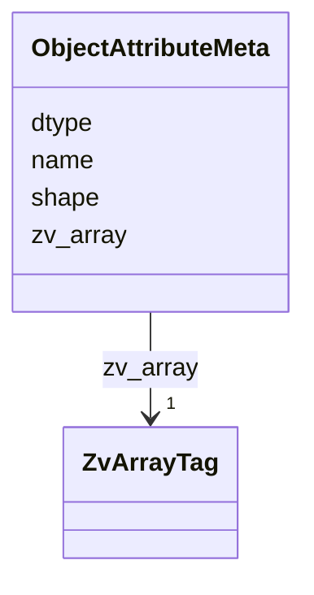


<!-- no inheritance hierarchy -->

## Slots

| Name | Cardinality and Range | Description | Inheritance |
| ---  | --- | --- | --- |
| [zv_array](zv_array.md) | 1 <br/> [ZvArrayTag](ZvArrayTag.md) | Discriminator slot identifying the kind of per-array `` | direct |
| [name](name.md) | 1 <br/> [String](String.md) | NGFF axis or attribute name (e | direct |
| [dtype](dtype.md) | 1 <br/> [String](String.md) | Numpy dtype string of the array's value type (e | direct |
| [shape](shape.md) | 1..* <br/> [Integer](Integer.md) | Shape of a dense per-object/per-group array | direct |


## Identifier and Mapping Information


### Schema Source


* from schema: https://w3id.org/zarr-vectors/schema/0.5


## Mappings

| Mapping Type | Mapped Value |
| ---  | ---  |
| self | zv:ObjectAttributeMeta |
| native | zv:ObjectAttributeMeta |


## LinkML Source

### Direct

<details>
```yaml
name: ObjectAttributeMeta
description: '``.zattrs`` for each ``object_attributes/<name>/`` array.'
from_schema: https://w3id.org/zarr-vectors/schema/0.5
rank: 1000
slots:
- zv_array
- name
- dtype
- shape
slot_usage:
  zv_array:
    name: zv_array
    required: true
    equals_string: object_attribute

```
</details>

### Induced

<details>
```yaml
name: ObjectAttributeMeta
description: '``.zattrs`` for each ``object_attributes/<name>/`` array.'
from_schema: https://w3id.org/zarr-vectors/schema/0.5
rank: 1000
slot_usage:
  zv_array:
    name: zv_array
    required: true
    equals_string: object_attribute
attributes:
  zv_array:
    name: zv_array
    description: 'Discriminator slot identifying the kind of per-array ``.zattrs``
      block.  Each writer in ``core/arrays.py`` stamps the corresponding token from
      :class:`ZvArrayTag`.

      '
    from_schema: https://w3id.org/zarr-vectors/schema/0.5
    rank: 1000
    alias: zv_array
    owner: ObjectAttributeMeta
    domain_of:
    - VerticesMeta
    - LinksMeta
    - AttributeMeta
    - ObjectIndexMeta
    - ObjectIndexPendingMeta
    - ObjectAttributeMeta
    - GroupingsMeta
    - GroupingsAttributeMeta
    - CrossChunkLinksMeta
    - CrossChunkFacesMeta
    - LinkAttributeMeta
    - CrossChunkLinkAttributeMeta
    - MetanodeChildrenMeta
    range: ZvArrayTag
    required: true
    equals_string: object_attribute
  name:
    name: name
    description: NGFF axis or attribute name (e.g. "x", "intensity").
    from_schema: https://w3id.org/zarr-vectors/schema/0.5
    rank: 1000
    slot_uri: schema:name
    alias: name
    owner: ObjectAttributeMeta
    domain_of:
    - Axis
    - AttributeMeta
    - ObjectAttributeMeta
    - GroupingsAttributeMeta
    - LinkAttributeMeta
    - CrossChunkLinkAttributeMeta
    range: string
    required: true
  dtype:
    name: dtype
    description: Numpy dtype string of the array's value type (e.g. "float32").
    from_schema: https://w3id.org/zarr-vectors/schema/0.5
    rank: 1000
    alias: dtype
    owner: ObjectAttributeMeta
    domain_of:
    - VerticesMeta
    - LinksMeta
    - AttributeMeta
    - ObjectAttributeMeta
    - GroupingsAttributeMeta
    - LinkAttributeMeta
    - CrossChunkLinkAttributeMeta
    range: string
    required: true
  shape:
    name: shape
    description: Shape of a dense per-object/per-group array.
    from_schema: https://w3id.org/zarr-vectors/schema/0.5
    rank: 1000
    alias: shape
    owner: ObjectAttributeMeta
    domain_of:
    - ObjectAttributeMeta
    - GroupingsAttributeMeta
    range: integer
    required: true
    multivalued: true

```
</details>


---

# Type: Objectidentifier 


_A URI or CURIE that represents an object in the model._


URI: [shex:iri](http://www.w3.org/ns/shex#iri)

## Type Properties

| Property | Value |
| --- | --- |
| Base | `ElementIdentifier` |
| Type URI | [shex:iri](http://www.w3.org/ns/shex#iri) |
| Representation | `str` |


## Comments

* Used for inheritance and type checking

## Notes

* If you are authoring schemas in LinkML YAML, the type is referenced with the lower case "objectidentifier".


## Identifier and Mapping Information


### Schema Source


* from schema: https://w3id.org/zarr-vectors/schema/0.5


## Mappings

| Mapping Type | Mapped Value |
| ---  | ---  |
| self | shex:iri |
| native | zv:objectidentifier |


---

# Enum: ObjectIndexConvention 


_How the object_id → vertex-group mapping is encoded._


URI: [zv:ObjectIndexConvention](https://w3id.org/zarr-vectors/schema/0.5/ObjectIndexConvention)

## Permissible Values
| Value | Meaning | Description |
| --- | --- | --- |
| standard | None | Full ``object_index`` array maps each object to its VG refs |
| identity | None | One object per vertex; only valid in single-chunk stores where the object_ind... |


## Slots

| Name | Description |
| ---  | --- |
| [object_index_convention](object_index_convention.md) |  |


## Identifier and Mapping Information


### Schema Source


* from schema: https://w3id.org/zarr-vectors/schema/0.5


## LinkML Source

<details>
```yaml
name: ObjectIndexConvention
description: How the object_id → vertex-group mapping is encoded.
from_schema: https://w3id.org/zarr-vectors/schema/0.5
rank: 1000
permissible_values:
  standard:
    text: standard
    description: Full ``object_index`` array maps each object to its VG refs.
  identity:
    text: identity
    description: 'One object per vertex; only valid in single-chunk stores where the
      object_index would be redundant.

      '

```
</details>


---


# Class: ObjectIndexMeta 


_``.zattrs`` for ``object_index/``._


URI: [zv:ObjectIndexMeta](https://w3id.org/zarr-vectors/schema/0.5/ObjectIndexMeta)


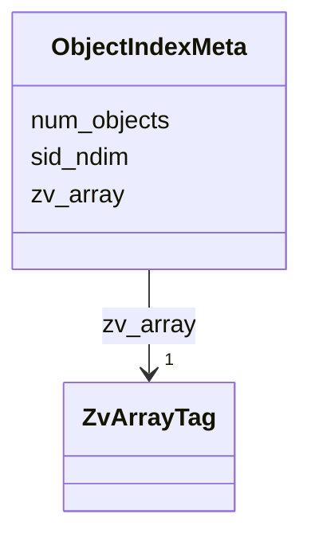


<!-- no inheritance hierarchy -->

## Slots

| Name | Cardinality and Range | Description | Inheritance |
| ---  | --- | --- | --- |
| [zv_array](zv_array.md) | 1 <br/> [ZvArrayTag](ZvArrayTag.md) | Discriminator slot identifying the kind of per-array `` | direct |
| [num_objects](num_objects.md) | 1 <br/> [Integer](Integer.md) | Total object count this array carries | direct |
| [sid_ndim](sid_ndim.md) | 1 <br/> [Integer](Integer.md) | Number of spatial-index dimensions encoded in chunk keys | direct |


## Identifier and Mapping Information


### Schema Source


* from schema: https://w3id.org/zarr-vectors/schema/0.5


## Mappings

| Mapping Type | Mapped Value |
| ---  | ---  |
| self | zv:ObjectIndexMeta |
| native | zv:ObjectIndexMeta |


## LinkML Source

### Direct

<details>
```yaml
name: ObjectIndexMeta
description: '``.zattrs`` for ``object_index/``.'
from_schema: https://w3id.org/zarr-vectors/schema/0.5
rank: 1000
slots:
- zv_array
- num_objects
- sid_ndim
slot_usage:
  zv_array:
    name: zv_array
    required: true
    equals_string: object_index

```
</details>

### Induced

<details>
```yaml
name: ObjectIndexMeta
description: '``.zattrs`` for ``object_index/``.'
from_schema: https://w3id.org/zarr-vectors/schema/0.5
rank: 1000
slot_usage:
  zv_array:
    name: zv_array
    required: true
    equals_string: object_index
attributes:
  zv_array:
    name: zv_array
    description: 'Discriminator slot identifying the kind of per-array ``.zattrs``
      block.  Each writer in ``core/arrays.py`` stamps the corresponding token from
      :class:`ZvArrayTag`.

      '
    from_schema: https://w3id.org/zarr-vectors/schema/0.5
    rank: 1000
    alias: zv_array
    owner: ObjectIndexMeta
    domain_of:
    - VerticesMeta
    - LinksMeta
    - AttributeMeta
    - ObjectIndexMeta
    - ObjectIndexPendingMeta
    - ObjectAttributeMeta
    - GroupingsMeta
    - GroupingsAttributeMeta
    - CrossChunkLinksMeta
    - CrossChunkFacesMeta
    - LinkAttributeMeta
    - CrossChunkLinkAttributeMeta
    - MetanodeChildrenMeta
    range: ZvArrayTag
    required: true
    equals_string: object_index
  num_objects:
    name: num_objects
    description: Total object count this array carries.
    from_schema: https://w3id.org/zarr-vectors/schema/0.5
    rank: 1000
    alias: num_objects
    owner: ObjectIndexMeta
    domain_of:
    - ObjectIndexMeta
    - ObjectIndexPendingMeta
    range: integer
    required: true
    minimum_value: 0
  sid_ndim:
    name: sid_ndim
    description: Number of spatial-index dimensions encoded in chunk keys.
    from_schema: https://w3id.org/zarr-vectors/schema/0.5
    rank: 1000
    alias: sid_ndim
    owner: ObjectIndexMeta
    domain_of:
    - ObjectIndexMeta
    - ObjectIndexPendingMeta
    - CrossChunkLinksMeta
    - CrossChunkFacesMeta
    - MetanodeChildrenMeta
    range: integer
    required: true
    minimum_value: 1

```
</details>


---


# Class: ObjectIndexPendingMeta 


_``.zattrs`` for ``object_index/pending/<batch_id>/``._


URI: [zv:ObjectIndexPendingMeta](https://w3id.org/zarr-vectors/schema/0.5/ObjectIndexPendingMeta)


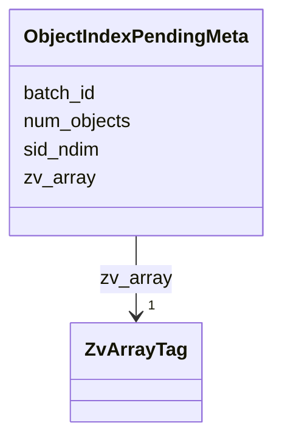


<!-- no inheritance hierarchy -->

## Slots

| Name | Cardinality and Range | Description | Inheritance |
| ---  | --- | --- | --- |
| [zv_array](zv_array.md) | 1 <br/> [ZvArrayTag](ZvArrayTag.md) | Discriminator slot identifying the kind of per-array `` | direct |
| [batch_id](batch_id.md) | 1 <br/> [Integer](Integer.md) | Monotonic batch id for an ``object_index/pending/<batch>`` sidecar | direct |
| [num_objects](num_objects.md) | 1 <br/> [Integer](Integer.md) | Total object count this array carries | direct |
| [sid_ndim](sid_ndim.md) | 1 <br/> [Integer](Integer.md) | Number of spatial-index dimensions encoded in chunk keys | direct |


## Identifier and Mapping Information


### Schema Source


* from schema: https://w3id.org/zarr-vectors/schema/0.5


## Mappings

| Mapping Type | Mapped Value |
| ---  | ---  |
| self | zv:ObjectIndexPendingMeta |
| native | zv:ObjectIndexPendingMeta |


## LinkML Source

### Direct

<details>
```yaml
name: ObjectIndexPendingMeta
description: '``.zattrs`` for ``object_index/pending/<batch_id>/``.'
from_schema: https://w3id.org/zarr-vectors/schema/0.5
rank: 1000
slots:
- zv_array
- batch_id
- num_objects
- sid_ndim
slot_usage:
  zv_array:
    name: zv_array
    required: true
    equals_string: object_index_pending

```
</details>

### Induced

<details>
```yaml
name: ObjectIndexPendingMeta
description: '``.zattrs`` for ``object_index/pending/<batch_id>/``.'
from_schema: https://w3id.org/zarr-vectors/schema/0.5
rank: 1000
slot_usage:
  zv_array:
    name: zv_array
    required: true
    equals_string: object_index_pending
attributes:
  zv_array:
    name: zv_array
    description: 'Discriminator slot identifying the kind of per-array ``.zattrs``
      block.  Each writer in ``core/arrays.py`` stamps the corresponding token from
      :class:`ZvArrayTag`.

      '
    from_schema: https://w3id.org/zarr-vectors/schema/0.5
    rank: 1000
    alias: zv_array
    owner: ObjectIndexPendingMeta
    domain_of:
    - VerticesMeta
    - LinksMeta
    - AttributeMeta
    - ObjectIndexMeta
    - ObjectIndexPendingMeta
    - ObjectAttributeMeta
    - GroupingsMeta
    - GroupingsAttributeMeta
    - CrossChunkLinksMeta
    - CrossChunkFacesMeta
    - LinkAttributeMeta
    - CrossChunkLinkAttributeMeta
    - MetanodeChildrenMeta
    range: ZvArrayTag
    required: true
    equals_string: object_index_pending
  batch_id:
    name: batch_id
    description: Monotonic batch id for an ``object_index/pending/<batch>`` sidecar.
    from_schema: https://w3id.org/zarr-vectors/schema/0.5
    rank: 1000
    alias: batch_id
    owner: ObjectIndexPendingMeta
    domain_of:
    - ObjectIndexPendingMeta
    range: integer
    required: true
    minimum_value: 0
  num_objects:
    name: num_objects
    description: Total object count this array carries.
    from_schema: https://w3id.org/zarr-vectors/schema/0.5
    rank: 1000
    alias: num_objects
    owner: ObjectIndexPendingMeta
    domain_of:
    - ObjectIndexMeta
    - ObjectIndexPendingMeta
    range: integer
    required: true
    minimum_value: 0
  sid_ndim:
    name: sid_ndim
    description: Number of spatial-index dimensions encoded in chunk keys.
    from_schema: https://w3id.org/zarr-vectors/schema/0.5
    rank: 1000
    alias: sid_ndim
    owner: ObjectIndexPendingMeta
    domain_of:
    - ObjectIndexMeta
    - ObjectIndexPendingMeta
    - CrossChunkLinksMeta
    - CrossChunkFacesMeta
    - MetanodeChildrenMeta
    range: integer
    required: true
    minimum_value: 1

```
</details>


---


# Slot: parent_level 


_Source level index (None for level 0)._


URI: [zv:parent_level](https://w3id.org/zarr-vectors/schema/0.5/parent_level)
Alias: parent_level

<!-- no inheritance hierarchy -->


## Applicable Classes

| Name | Description | Modifies Slot |
| --- | --- | --- |
| [LevelMetadata](LevelMetadata.md) | Per-resolution-level `` |  no  |


## Properties

### Type and Range

| Property | Value |
| --- | --- |
| Range | [Integer](Integer.md) |
| Domain Of | [LevelMetadata](LevelMetadata.md) |

### Cardinality and Requirements

| Property | Value |
| --- | --- |
### Value Constraints

| Property | Value |
| --- | --- |
| Minimum Value | 0 |


## Identifier and Mapping Information


### Schema Source


* from schema: https://w3id.org/zarr-vectors/schema/0.5


## Mappings

| Mapping Type | Mapped Value |
| ---  | ---  |
| self | zv:parent_level |
| native | zv:parent_level |


## LinkML Source

<details>
```yaml
name: parent_level
description: Source level index (None for level 0).
from_schema: https://w3id.org/zarr-vectors/schema/0.5
rank: 1000
alias: parent_level
domain_of:
- LevelMetadata
range: integer
minimum_value: 0

```
</details>


---


# Slot: preserves_object_ids 


_True for levels written by the per-object pyramid regime.  When set, ``num_objects`` and ``object_attributes`` row count inherit from the parent level's OID space; dropped objects leave empty manifest slots and zero ``present_mask`` bytes.  ``parent_level`` is load-bearing under this flag._

__


URI: [zv:preserves_object_ids](https://w3id.org/zarr-vectors/schema/0.5/preserves_object_ids)
Alias: preserves_object_ids

<!-- no inheritance hierarchy -->


## Applicable Classes

| Name | Description | Modifies Slot |
| --- | --- | --- |
| [LevelMetadata](LevelMetadata.md) | Per-resolution-level `` |  no  |


## Properties

### Type and Range

| Property | Value |
| --- | --- |
| Range | [Boolean](Boolean.md) |
| Domain Of | [LevelMetadata](LevelMetadata.md) |

### Cardinality and Requirements

| Property | Value |
| --- | --- |


## Identifier and Mapping Information


### Schema Source


* from schema: https://w3id.org/zarr-vectors/schema/0.5


## Mappings

| Mapping Type | Mapped Value |
| ---  | ---  |
| self | zv:preserves_object_ids |
| native | zv:preserves_object_ids |


## LinkML Source

<details>
```yaml
name: preserves_object_ids
description: 'True for levels written by the per-object pyramid regime.  When set,
  ``num_objects`` and ``object_attributes`` row count inherit from the parent level''s
  OID space; dropped objects leave empty manifest slots and zero ``present_mask``
  bytes.  ``parent_level`` is load-bearing under this flag.

  '
from_schema: https://w3id.org/zarr-vectors/schema/0.5
rank: 1000
alias: preserves_object_ids
domain_of:
- LevelMetadata
range: boolean

```
</details>


---


# Slot: record_size 


_Per-face record width in ``cross_chunk_faces/data`` (sid_ndim + 2 int64s)._

__


URI: [zv:record_size](https://w3id.org/zarr-vectors/schema/0.5/record_size)
Alias: record_size

<!-- no inheritance hierarchy -->


## Applicable Classes

| Name | Description | Modifies Slot |
| --- | --- | --- |
| [CrossChunkFacesMeta](CrossChunkFacesMeta.md) | `` |  no  |


## Properties

### Type and Range

| Property | Value |
| --- | --- |
| Range | [Integer](Integer.md) |
| Domain Of | [CrossChunkFacesMeta](CrossChunkFacesMeta.md) |

### Cardinality and Requirements

| Property | Value |
| --- | --- |
| Required | Yes |
### Value Constraints

| Property | Value |
| --- | --- |
| Minimum Value | 2 |


## Identifier and Mapping Information


### Schema Source


* from schema: https://w3id.org/zarr-vectors/schema/0.5


## Mappings

| Mapping Type | Mapped Value |
| ---  | ---  |
| self | zv:record_size |
| native | zv:record_size |


## LinkML Source

<details>
```yaml
name: record_size
description: 'Per-face record width in ``cross_chunk_faces/data`` (sid_ndim + 2 int64s).

  '
from_schema: https://w3id.org/zarr-vectors/schema/0.5
rank: 1000
alias: record_size
domain_of:
- CrossChunkFacesMeta
range: integer
required: true
minimum_value: 2

```
</details>


---


# Slot: reduction_factor 


_Multi-resolution coarsening factor (≥ 2)._


URI: [zv:reduction_factor](https://w3id.org/zarr-vectors/schema/0.5/reduction_factor)
Alias: reduction_factor

<!-- no inheritance hierarchy -->


## Applicable Classes

| Name | Description | Modifies Slot |
| --- | --- | --- |
| [RootMetadata](RootMetadata.md) | Root-level `` |  no  |


## Properties

### Type and Range

| Property | Value |
| --- | --- |
| Range | [Integer](Integer.md) |
| Domain Of | [RootMetadata](RootMetadata.md) |

### Cardinality and Requirements

| Property | Value |
| --- | --- |
### Value Constraints

| Property | Value |
| --- | --- |
| Minimum Value | 2 |


## Identifier and Mapping Information


### Schema Source


* from schema: https://w3id.org/zarr-vectors/schema/0.5


## Mappings

| Mapping Type | Mapped Value |
| ---  | ---  |
| self | zv:reduction_factor |
| native | zv:reduction_factor |


## LinkML Source

<details>
```yaml
name: reduction_factor
description: Multi-resolution coarsening factor (≥ 2).
from_schema: https://w3id.org/zarr-vectors/schema/0.5
rank: 1000
alias: reduction_factor
domain_of:
- RootMetadata
range: integer
minimum_value: 2

```
</details>


---


# Class: RootMetadata 


_Root-level ``.zattrs`` payload, persisted under the key ``zarr_vectors``.  Validates the runtime :class:`zarr_vectors.core.metadata.RootMetadata` dataclass. Note: the canonical axis list lives in ``multiscales[0].axes`` at root level (NGFF-style), NOT under ``zarr_vectors`` — see ``MultiscalesMetadata``._

__


URI: [zv:RootMetadata](https://w3id.org/zarr-vectors/schema/0.5/RootMetadata)


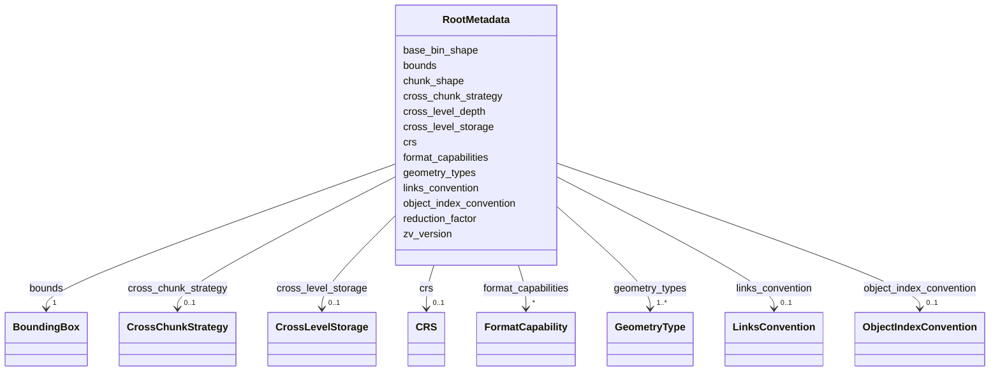


<!-- no inheritance hierarchy -->

## Slots

| Name | Cardinality and Range | Description | Inheritance |
| ---  | --- | --- | --- |
| [zv_version](zv_version.md) | 1 <br/> [String](String.md) | ZV spec version this store was written against (e | direct |
| [chunk_shape](chunk_shape.md) | 1..* <br/> [Float](Float.md) | Physical spatial chunk size per axis (all values > 0) | direct |
| [bounds](bounds.md) | 1 <br/> [BoundingBox](BoundingBox.md) | Global vertex bounding box | direct |
| [geometry_types](geometry_types.md) | 1..* <br/> [GeometryType](GeometryType.md) | One or more geometry kinds present in the store | direct |
| [crs](crs.md) | 0..1 <br/> [CRS](CRS.md) | Optional coordinate reference system metadata (free-form dict matching whatev... | direct |
| [links_convention](links_convention.md) | 0..1 <br/> [LinksConvention](LinksConvention.md) |  | direct |
| [object_index_convention](object_index_convention.md) | 0..1 <br/> [ObjectIndexConvention](ObjectIndexConvention.md) |  | direct |
| [cross_chunk_strategy](cross_chunk_strategy.md) | 0..1 <br/> [CrossChunkStrategy](CrossChunkStrategy.md) |  | direct |
| [cross_level_depth](cross_level_depth.md) | 0..1 <br/> [Integer](Integer.md) | Maximum absolute level delta for which cross-pyramid-level link arrays are ma... | direct |
| [cross_level_storage](cross_level_storage.md) | 0..1 <br/> [CrossLevelStorage](CrossLevelStorage.md) | Whether cross-level link arrays are written in both directions (``explicit``:... | direct |
| [reduction_factor](reduction_factor.md) | 0..1 <br/> [Integer](Integer.md) | Multi-resolution coarsening factor (≥ 2) | direct |
| [base_bin_shape](base_bin_shape.md) | * <br/> [Float](Float.md) | Supervoxel bin edge lengths at level 0 | direct |
| [format_capabilities](format_capabilities.md) | * <br/> [FormatCapability](FormatCapability.md) | Optional 0 | direct |


## Identifier and Mapping Information


### Schema Source


* from schema: https://w3id.org/zarr-vectors/schema/0.5


## Mappings

| Mapping Type | Mapped Value |
| ---  | ---  |
| self | zv:RootMetadata |
| native | zv:RootMetadata |


## LinkML Source

### Direct

<details>
```yaml
name: RootMetadata
description: 'Root-level ``.zattrs`` payload, persisted under the key ``zarr_vectors``.  Validates
  the runtime :class:`zarr_vectors.core.metadata.RootMetadata` dataclass. Note: the
  canonical axis list lives in ``multiscales[0].axes`` at root level (NGFF-style),
  NOT under ``zarr_vectors`` — see ``MultiscalesMetadata``.

  '
from_schema: https://w3id.org/zarr-vectors/schema/0.5
rank: 1000
slots:
- zv_version
- chunk_shape
- bounds
- geometry_types
- crs
- links_convention
- object_index_convention
- cross_chunk_strategy
- cross_level_depth
- cross_level_storage
- reduction_factor
- base_bin_shape
- format_capabilities

```
</details>

### Induced

<details>
```yaml
name: RootMetadata
description: 'Root-level ``.zattrs`` payload, persisted under the key ``zarr_vectors``.  Validates
  the runtime :class:`zarr_vectors.core.metadata.RootMetadata` dataclass. Note: the
  canonical axis list lives in ``multiscales[0].axes`` at root level (NGFF-style),
  NOT under ``zarr_vectors`` — see ``MultiscalesMetadata``.

  '
from_schema: https://w3id.org/zarr-vectors/schema/0.5
rank: 1000
attributes:
  zv_version:
    name: zv_version
    description: 'ZV spec version this store was written against (e.g. "0.5.0"). Renamed
      from ``format_version`` in 0.5.0 to disambiguate from Zarr v3''s ``zarr_format``
      field.

      '
    from_schema: https://w3id.org/zarr-vectors/schema/0.5
    rank: 1000
    slot_uri: schema:version
    alias: zv_version
    owner: RootMetadata
    domain_of:
    - RootMetadata
    range: string
    required: true
    pattern: ^\d+\.\d+(\.\d+)?$
  chunk_shape:
    name: chunk_shape
    description: Physical spatial chunk size per axis (all values > 0).
    from_schema: https://w3id.org/zarr-vectors/schema/0.5
    rank: 1000
    alias: chunk_shape
    owner: RootMetadata
    domain_of:
    - RootMetadata
    range: float
    required: true
    multivalued: true
  bounds:
    name: bounds
    description: Global vertex bounding box.
    from_schema: https://w3id.org/zarr-vectors/schema/0.5
    rank: 1000
    alias: bounds
    owner: RootMetadata
    domain_of:
    - RootMetadata
    range: BoundingBox
    required: true
  geometry_types:
    name: geometry_types
    description: One or more geometry kinds present in the store.
    from_schema: https://w3id.org/zarr-vectors/schema/0.5
    rank: 1000
    alias: geometry_types
    owner: RootMetadata
    domain_of:
    - RootMetadata
    range: GeometryType
    required: true
    multivalued: true
    minimum_cardinality: 1
  crs:
    name: crs
    description: 'Optional coordinate reference system metadata (free-form dict matching
      whatever CRS vocabulary the store uses, e.g. WKT, PROJ4, EPSG, CF conventions).

      '
    from_schema: https://w3id.org/zarr-vectors/schema/0.5
    rank: 1000
    slot_uri: schema:coordinateReferenceSystem
    alias: crs
    owner: RootMetadata
    domain_of:
    - RootMetadata
    range: CRS
    inlined: true
  links_convention:
    name: links_convention
    from_schema: https://w3id.org/zarr-vectors/schema/0.5
    rank: 1000
    alias: links_convention
    owner: RootMetadata
    domain_of:
    - RootMetadata
    range: LinksConvention
  object_index_convention:
    name: object_index_convention
    from_schema: https://w3id.org/zarr-vectors/schema/0.5
    rank: 1000
    alias: object_index_convention
    owner: RootMetadata
    domain_of:
    - RootMetadata
    range: ObjectIndexConvention
  cross_chunk_strategy:
    name: cross_chunk_strategy
    from_schema: https://w3id.org/zarr-vectors/schema/0.5
    rank: 1000
    alias: cross_chunk_strategy
    owner: RootMetadata
    domain_of:
    - RootMetadata
    range: CrossChunkStrategy
  cross_level_depth:
    name: cross_level_depth
    description: 'Maximum absolute level delta for which cross-pyramid-level link
      arrays are materialized.  ``0`` = none (no ``+N`` or ``-N`` arrays), ``N`` =
      generate up to ``±N`` (or ``+N`` only when ``cross_level_storage="implicit"``),
      ``-1`` = all available pyramid levels.  Default ``1``.

      '
    from_schema: https://w3id.org/zarr-vectors/schema/0.5
    rank: 1000
    alias: cross_level_depth
    owner: RootMetadata
    domain_of:
    - RootMetadata
    range: integer
    minimum_value: -1
  cross_level_storage:
    name: cross_level_storage
    description: 'Whether cross-level link arrays are written in both directions (``explicit``:
      ``+N`` at the finer level AND ``-N`` at the coarser level) or only positive
      deltas (``implicit``: only ``+N``, with ``-N`` reconstructed on read).  Default
      ``explicit``.

      '
    from_schema: https://w3id.org/zarr-vectors/schema/0.5
    rank: 1000
    alias: cross_level_storage
    owner: RootMetadata
    domain_of:
    - RootMetadata
    range: CrossLevelStorage
  reduction_factor:
    name: reduction_factor
    description: Multi-resolution coarsening factor (≥ 2).
    from_schema: https://w3id.org/zarr-vectors/schema/0.5
    rank: 1000
    alias: reduction_factor
    owner: RootMetadata
    domain_of:
    - RootMetadata
    range: integer
    minimum_value: 2
  base_bin_shape:
    name: base_bin_shape
    description: 'Supervoxel bin edge lengths at level 0.  When set, every value must
      be > 0 and ``chunk_shape`` must be an integer multiple along every axis (enforced
      runtime-side in ``RootMetadata.validate``).

      '
    from_schema: https://w3id.org/zarr-vectors/schema/0.5
    rank: 1000
    alias: base_bin_shape
    owner: RootMetadata
    domain_of:
    - RootMetadata
    range: float
    multivalued: true
  format_capabilities:
    name: format_capabilities
    description: Optional 0.3+ feature tokens advertised by this store.
    from_schema: https://w3id.org/zarr-vectors/schema/0.5
    rank: 1000
    alias: format_capabilities
    owner: RootMetadata
    domain_of:
    - RootMetadata
    range: FormatCapability
    multivalued: true

```
</details>


---


# Slot: shape 


_Shape of a dense per-object/per-group array._


URI: [zv:shape](https://w3id.org/zarr-vectors/schema/0.5/shape)
Alias: shape

<!-- no inheritance hierarchy -->


## Applicable Classes

| Name | Description | Modifies Slot |
| --- | --- | --- |
| [GroupingsAttributeMeta](GroupingsAttributeMeta.md) | `` |  no  |
| [ObjectAttributeMeta](ObjectAttributeMeta.md) | `` |  no  |


## Properties

### Type and Range

| Property | Value |
| --- | --- |
| Range | [Integer](Integer.md) |
| Domain Of | [ObjectAttributeMeta](ObjectAttributeMeta.md), [GroupingsAttributeMeta](GroupingsAttributeMeta.md) |

### Cardinality and Requirements

| Property | Value |
| --- | --- |
| Required | Yes |
| Multivalued | Yes |


## Identifier and Mapping Information


### Schema Source


* from schema: https://w3id.org/zarr-vectors/schema/0.5


## Mappings

| Mapping Type | Mapped Value |
| ---  | ---  |
| self | zv:shape |
| native | zv:shape |


## LinkML Source

<details>
```yaml
name: shape
description: Shape of a dense per-object/per-group array.
from_schema: https://w3id.org/zarr-vectors/schema/0.5
rank: 1000
alias: shape
domain_of:
- ObjectAttributeMeta
- GroupingsAttributeMeta
range: integer
required: true
multivalued: true

```
</details>


---


# Slot: shared_vertex_groups 


_True when per-chunk vertex groups may be referenced by multiple objects' manifests (shared metavertices in the per-object pyramid regime).  Readers MAY use this to short-circuit dedup work._

__


URI: [zv:shared_vertex_groups](https://w3id.org/zarr-vectors/schema/0.5/shared_vertex_groups)
Alias: shared_vertex_groups

<!-- no inheritance hierarchy -->


## Applicable Classes

| Name | Description | Modifies Slot |
| --- | --- | --- |
| [LevelMetadata](LevelMetadata.md) | Per-resolution-level `` |  no  |


## Properties

### Type and Range

| Property | Value |
| --- | --- |
| Range | [Boolean](Boolean.md) |
| Domain Of | [LevelMetadata](LevelMetadata.md) |

### Cardinality and Requirements

| Property | Value |
| --- | --- |


## Identifier and Mapping Information


### Schema Source


* from schema: https://w3id.org/zarr-vectors/schema/0.5


## Mappings

| Mapping Type | Mapped Value |
| ---  | ---  |
| self | zv:shared_vertex_groups |
| native | zv:shared_vertex_groups |


## LinkML Source

<details>
```yaml
name: shared_vertex_groups
description: 'True when per-chunk vertex groups may be referenced by multiple objects''
  manifests (shared metavertices in the per-object pyramid regime).  Readers MAY use
  this to short-circuit dedup work.

  '
from_schema: https://w3id.org/zarr-vectors/schema/0.5
rank: 1000
alias: shared_vertex_groups
domain_of:
- LevelMetadata
range: boolean

```
</details>


---


# Slot: sid_ndim 


_Number of spatial-index dimensions encoded in chunk keys._


URI: [zv:sid_ndim](https://w3id.org/zarr-vectors/schema/0.5/sid_ndim)
Alias: sid_ndim

<!-- no inheritance hierarchy -->


## Applicable Classes

| Name | Description | Modifies Slot |
| --- | --- | --- |
| [ObjectIndexMeta](ObjectIndexMeta.md) | `` |  no  |
| [CrossChunkLinksMeta](CrossChunkLinksMeta.md) | `` |  no  |
| [CrossChunkFacesMeta](CrossChunkFacesMeta.md) | `` |  no  |
| [MetanodeChildrenMeta](MetanodeChildrenMeta.md) | `` |  no  |
| [ObjectIndexPendingMeta](ObjectIndexPendingMeta.md) | `` |  no  |


## Properties

### Type and Range

| Property | Value |
| --- | --- |
| Range | [Integer](Integer.md) |
| Domain Of | [ObjectIndexMeta](ObjectIndexMeta.md), [ObjectIndexPendingMeta](ObjectIndexPendingMeta.md), [CrossChunkLinksMeta](CrossChunkLinksMeta.md), [CrossChunkFacesMeta](CrossChunkFacesMeta.md), [MetanodeChildrenMeta](MetanodeChildrenMeta.md) |

### Cardinality and Requirements

| Property | Value |
| --- | --- |
| Required | Yes |
### Value Constraints

| Property | Value |
| --- | --- |
| Minimum Value | 1 |


## Identifier and Mapping Information


### Schema Source


* from schema: https://w3id.org/zarr-vectors/schema/0.5


## Mappings

| Mapping Type | Mapped Value |
| ---  | ---  |
| self | zv:sid_ndim |
| native | zv:sid_ndim |


## LinkML Source

<details>
```yaml
name: sid_ndim
description: Number of spatial-index dimensions encoded in chunk keys.
from_schema: https://w3id.org/zarr-vectors/schema/0.5
rank: 1000
alias: sid_ndim
domain_of:
- ObjectIndexMeta
- ObjectIndexPendingMeta
- CrossChunkLinksMeta
- CrossChunkFacesMeta
- MetanodeChildrenMeta
range: integer
required: true
minimum_value: 1

```
</details>


---

# Type: Sparqlpath 


_A string encoding a SPARQL Property Path. The value of the string MUST conform to SPARQL syntax and SHOULD dereference to zero or more valid objects within the current instance document when encoded as RDF._


URI: [xsd:string](http://www.w3.org/2001/XMLSchema#string)

## Type Properties

| Property | Value |
| --- | --- |
| Base | `str` |
| Type URI | [xsd:string](http://www.w3.org/2001/XMLSchema#string) |
| Representation | `str` |


## Notes

* If you are authoring schemas in LinkML YAML, the type is referenced with the lower case "sparqlpath".


## Identifier and Mapping Information


### Schema Source


* from schema: https://w3id.org/zarr-vectors/schema/0.5


## Mappings

| Mapping Type | Mapped Value |
| ---  | ---  |
| self | xsd:string |
| native | zv:sparqlpath |


---

# Type: String 


_A character string_


URI: [xsd:string](http://www.w3.org/2001/XMLSchema#string)

## Type Properties

| Property | Value |
| --- | --- |
| Base | `str` |
| Type URI | [xsd:string](http://www.w3.org/2001/XMLSchema#string) |


## Notes

* In RDF serializations, a slot with range of string is treated as a literal or type xsd:string.   If you are authoring schemas in LinkML YAML, the type is referenced with the lower case "string".


## Identifier and Mapping Information


### Schema Source


* from schema: https://w3id.org/zarr-vectors/schema/0.5


## Mappings

| Mapping Type | Mapped Value |
| ---  | ---  |
| self | xsd:string |
| native | zv:string |
| exact | schema:Text |


---

# Type: Time 


_A time object represents a (local) time of day, independent of any particular day_


URI: [xsd:time](http://www.w3.org/2001/XMLSchema#time)

## Type Properties

| Property | Value |
| --- | --- |
| Base | `XSDTime` |
| Type URI | [xsd:time](http://www.w3.org/2001/XMLSchema#time) |
| Representation | `str` |


## Notes

* URI is dateTime because OWL reasoners do not work with straight date or time
* If you are authoring schemas in LinkML YAML, the type is referenced with the lower case "time".


## Identifier and Mapping Information


### Schema Source


* from schema: https://w3id.org/zarr-vectors/schema/0.5


## Mappings

| Mapping Type | Mapped Value |
| ---  | ---  |
| self | xsd:time |
| native | zv:time |
| exact | schema:Time |


---


# Slot: type 


_NGFF axis type — "space", "time", or "channel"._


URI: [zv:type](https://w3id.org/zarr-vectors/schema/0.5/type)
Alias: type

<!-- no inheritance hierarchy -->


## Applicable Classes

| Name | Description | Modifies Slot |
| --- | --- | --- |
| [Axis](Axis.md) | One axis of the spatial index |  no  |


## Properties

### Type and Range

| Property | Value |
| --- | --- |
| Range | [String](String.md) |
| Domain Of | [Axis](Axis.md) |

### Cardinality and Requirements

| Property | Value |
| --- | --- |
| Required | Yes |


## Identifier and Mapping Information


### Schema Source


* from schema: https://w3id.org/zarr-vectors/schema/0.5


## Mappings

| Mapping Type | Mapped Value |
| ---  | ---  |
| self | zv:type |
| native | zv:type |


## LinkML Source

<details>
```yaml
name: type
description: NGFF axis type — "space", "time", or "channel".
from_schema: https://w3id.org/zarr-vectors/schema/0.5
rank: 1000
alias: type
domain_of:
- Axis
range: string
required: true

```
</details>


---


# Slot: unit 


_NGFF unit string (e.g. "um", "nanometer", "second")._


URI: [zv:unit](https://w3id.org/zarr-vectors/schema/0.5/unit)
Alias: unit

<!-- no inheritance hierarchy -->


## Applicable Classes

| Name | Description | Modifies Slot |
| --- | --- | --- |
| [Axis](Axis.md) | One axis of the spatial index |  no  |


## Properties

### Type and Range

| Property | Value |
| --- | --- |
| Range | [String](String.md) |
| Domain Of | [Axis](Axis.md) |

### Cardinality and Requirements

| Property | Value |
| --- | --- |


## Identifier and Mapping Information


### Schema Source


* from schema: https://w3id.org/zarr-vectors/schema/0.5


## Mappings

| Mapping Type | Mapped Value |
| ---  | ---  |
| self | zv:unit |
| native | zv:unit |


## LinkML Source

<details>
```yaml
name: unit
description: NGFF unit string (e.g. "um", "nanometer", "second").
from_schema: https://w3id.org/zarr-vectors/schema/0.5
rank: 1000
alias: unit
domain_of:
- Axis
range: string

```
</details>


---

# Type: Uri 


_a complete URI_


URI: [xsd:anyURI](http://www.w3.org/2001/XMLSchema#anyURI)

## Type Properties

| Property | Value |
| --- | --- |
| Base | `URI` |
| Type URI | [xsd:anyURI](http://www.w3.org/2001/XMLSchema#anyURI) |
| Representation | `str` |


## Comments

* in RDF serializations a slot with range of uri is treated as a literal or type xsd:anyURI unless it is an identifier or a reference to an identifier, in which case it is translated directly to a node

## Notes

* If you are authoring schemas in LinkML YAML, the type is referenced with the lower case "uri".


## Identifier and Mapping Information


### Schema Source


* from schema: https://w3id.org/zarr-vectors/schema/0.5


## Mappings

| Mapping Type | Mapped Value |
| ---  | ---  |
| self | xsd:anyURI |
| native | zv:uri |
| close | schema:URL |


---

# Type: Uriorcurie 


_a URI or a CURIE_


URI: [xsd:anyURI](http://www.w3.org/2001/XMLSchema#anyURI)

## Type Properties

| Property | Value |
| --- | --- |
| Base | `URIorCURIE` |
| Type URI | [xsd:anyURI](http://www.w3.org/2001/XMLSchema#anyURI) |
| Representation | `str` |


## Notes

* If you are authoring schemas in LinkML YAML, the type is referenced with the lower case "uriorcurie".


## Identifier and Mapping Information


### Schema Source


* from schema: https://w3id.org/zarr-vectors/schema/0.5


## Mappings

| Mapping Type | Mapped Value |
| ---  | ---  |
| self | xsd:anyURI |
| native | zv:uriorcurie |


---


# Slot: vertex_count 


_Total number of vertices at this level._


URI: [zv:vertex_count](https://w3id.org/zarr-vectors/schema/0.5/vertex_count)
Alias: vertex_count

<!-- no inheritance hierarchy -->


## Applicable Classes

| Name | Description | Modifies Slot |
| --- | --- | --- |
| [LevelMetadata](LevelMetadata.md) | Per-resolution-level `` |  no  |


## Properties

### Type and Range

| Property | Value |
| --- | --- |
| Range | [Integer](Integer.md) |
| Domain Of | [LevelMetadata](LevelMetadata.md) |

### Cardinality and Requirements

| Property | Value |
| --- | --- |
| Required | Yes |
### Value Constraints

| Property | Value |
| --- | --- |
| Minimum Value | 0 |


## Identifier and Mapping Information


### Schema Source


* from schema: https://w3id.org/zarr-vectors/schema/0.5


## Mappings

| Mapping Type | Mapped Value |
| ---  | ---  |
| self | zv:vertex_count |
| native | zv:vertex_count |


## LinkML Source

<details>
```yaml
name: vertex_count
description: Total number of vertices at this level.
from_schema: https://w3id.org/zarr-vectors/schema/0.5
rank: 1000
alias: vertex_count
domain_of:
- LevelMetadata
range: integer
required: true
minimum_value: 0

```
</details>


---


# Class: VerticesMeta 


_``.zattrs`` for the ``vertices/`` array._


URI: [zv:VerticesMeta](https://w3id.org/zarr-vectors/schema/0.5/VerticesMeta)


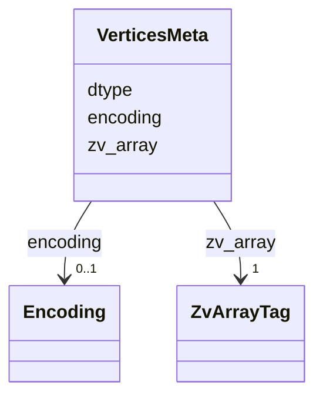


<!-- no inheritance hierarchy -->

## Slots

| Name | Cardinality and Range | Description | Inheritance |
| ---  | --- | --- | --- |
| [zv_array](zv_array.md) | 1 <br/> [ZvArrayTag](ZvArrayTag.md) | Discriminator slot identifying the kind of per-array `` | direct |
| [dtype](dtype.md) | 1 <br/> [String](String.md) | Numpy dtype string of the array's value type (e | direct |
| [encoding](encoding.md) | 0..1 <br/> [Encoding](Encoding.md) | How the chunk bytes are encoded | direct |


## Identifier and Mapping Information


### Schema Source


* from schema: https://w3id.org/zarr-vectors/schema/0.5


## Mappings

| Mapping Type | Mapped Value |
| ---  | ---  |
| self | zv:VerticesMeta |
| native | zv:VerticesMeta |


## LinkML Source

### Direct

<details>
```yaml
name: VerticesMeta
description: '``.zattrs`` for the ``vertices/`` array.'
from_schema: https://w3id.org/zarr-vectors/schema/0.5
rank: 1000
slots:
- zv_array
- dtype
- encoding
slot_usage:
  zv_array:
    name: zv_array
    required: true
    equals_string: vertices

```
</details>

### Induced

<details>
```yaml
name: VerticesMeta
description: '``.zattrs`` for the ``vertices/`` array.'
from_schema: https://w3id.org/zarr-vectors/schema/0.5
rank: 1000
slot_usage:
  zv_array:
    name: zv_array
    required: true
    equals_string: vertices
attributes:
  zv_array:
    name: zv_array
    description: 'Discriminator slot identifying the kind of per-array ``.zattrs``
      block.  Each writer in ``core/arrays.py`` stamps the corresponding token from
      :class:`ZvArrayTag`.

      '
    from_schema: https://w3id.org/zarr-vectors/schema/0.5
    rank: 1000
    alias: zv_array
    owner: VerticesMeta
    domain_of:
    - VerticesMeta
    - LinksMeta
    - AttributeMeta
    - ObjectIndexMeta
    - ObjectIndexPendingMeta
    - ObjectAttributeMeta
    - GroupingsMeta
    - GroupingsAttributeMeta
    - CrossChunkLinksMeta
    - CrossChunkFacesMeta
    - LinkAttributeMeta
    - CrossChunkLinkAttributeMeta
    - MetanodeChildrenMeta
    range: ZvArrayTag
    required: true
    equals_string: vertices
  dtype:
    name: dtype
    description: Numpy dtype string of the array's value type (e.g. "float32").
    from_schema: https://w3id.org/zarr-vectors/schema/0.5
    rank: 1000
    alias: dtype
    owner: VerticesMeta
    domain_of:
    - VerticesMeta
    - LinksMeta
    - AttributeMeta
    - ObjectAttributeMeta
    - GroupingsAttributeMeta
    - LinkAttributeMeta
    - CrossChunkLinkAttributeMeta
    range: string
    required: true
  encoding:
    name: encoding
    description: How the chunk bytes are encoded.
    from_schema: https://w3id.org/zarr-vectors/schema/0.5
    rank: 1000
    alias: encoding
    owner: VerticesMeta
    domain_of:
    - VerticesMeta
    range: Encoding

```
</details>


---

# zarr_vectors 

Reference schema for the Zarr Vectors (ZV) on-disk metadata (0.5.0). Covers the root-level ``.zattrs`` block (``zarr_vectors`` envelope), the NGFF ``multiscales`` block (which now carries the canonical axes list — ZV no longer duplicates them under ``spatial_index_dims``), the per-resolution-level ``.zattrs`` block (``zarr_vectors_level`` envelope), and the per-array ``.zattrs`` shapes emitted by the writers in ``zarr_vectors/core/arrays.py`` (discriminator slot ``zv_array``).


URI: https://w3id.org/zarr-vectors/schema/0.5


---


# Slot: zv_array 


_Discriminator slot identifying the kind of per-array ``.zattrs`` block.  Each writer in ``core/arrays.py`` stamps the corresponding token from :class:`ZvArrayTag`._

__


URI: [zv:zv_array](https://w3id.org/zarr-vectors/schema/0.5/zv_array)
Alias: zv_array

<!-- no inheritance hierarchy -->


## Applicable Classes

| Name | Description | Modifies Slot |
| --- | --- | --- |
| [ObjectIndexMeta](ObjectIndexMeta.md) | `` |  yes  |
| [LinkAttributeMeta](LinkAttributeMeta.md) | `` |  yes  |
| [CrossChunkLinksMeta](CrossChunkLinksMeta.md) | `` |  yes  |
| [LinksMeta](LinksMeta.md) | `` |  yes  |
| [AttributeMeta](AttributeMeta.md) | `` |  yes  |
| [GroupingsMeta](GroupingsMeta.md) | `` |  yes  |
| [CrossChunkFacesMeta](CrossChunkFacesMeta.md) | `` |  yes  |
| [CrossChunkLinkAttributeMeta](CrossChunkLinkAttributeMeta.md) | `` |  yes  |
| [ObjectAttributeMeta](ObjectAttributeMeta.md) | `` |  yes  |
| [MetanodeChildrenMeta](MetanodeChildrenMeta.md) | `` |  yes  |
| [GroupingsAttributeMeta](GroupingsAttributeMeta.md) | `` |  yes  |
| [ObjectIndexPendingMeta](ObjectIndexPendingMeta.md) | `` |  yes  |
| [VerticesMeta](VerticesMeta.md) | `` |  yes  |


## Properties

### Type and Range

| Property | Value |
| --- | --- |
| Range | [ZvArrayTag](ZvArrayTag.md) |
| Domain Of | [VerticesMeta](VerticesMeta.md), [LinksMeta](LinksMeta.md), [AttributeMeta](AttributeMeta.md), [ObjectIndexMeta](ObjectIndexMeta.md), [ObjectIndexPendingMeta](ObjectIndexPendingMeta.md), [ObjectAttributeMeta](ObjectAttributeMeta.md), [GroupingsMeta](GroupingsMeta.md), [GroupingsAttributeMeta](GroupingsAttributeMeta.md), [CrossChunkLinksMeta](CrossChunkLinksMeta.md), [CrossChunkFacesMeta](CrossChunkFacesMeta.md), [LinkAttributeMeta](LinkAttributeMeta.md), [CrossChunkLinkAttributeMeta](CrossChunkLinkAttributeMeta.md), [MetanodeChildrenMeta](MetanodeChildrenMeta.md) |

### Cardinality and Requirements

| Property | Value |
| --- | --- |
| Required | Yes |


## Identifier and Mapping Information


### Schema Source


* from schema: https://w3id.org/zarr-vectors/schema/0.5


## Mappings

| Mapping Type | Mapped Value |
| ---  | ---  |
| self | zv:zv_array |
| native | zv:zv_array |


## LinkML Source

<details>
```yaml
name: zv_array
description: 'Discriminator slot identifying the kind of per-array ``.zattrs`` block.  Each
  writer in ``core/arrays.py`` stamps the corresponding token from :class:`ZvArrayTag`.

  '
from_schema: https://w3id.org/zarr-vectors/schema/0.5
rank: 1000
alias: zv_array
domain_of:
- VerticesMeta
- LinksMeta
- AttributeMeta
- ObjectIndexMeta
- ObjectIndexPendingMeta
- ObjectAttributeMeta
- GroupingsMeta
- GroupingsAttributeMeta
- CrossChunkLinksMeta
- CrossChunkFacesMeta
- LinkAttributeMeta
- CrossChunkLinkAttributeMeta
- MetanodeChildrenMeta
range: ZvArrayTag
required: true

```
</details>


---


# Slot: zv_version 


_ZV spec version this store was written against (e.g. "0.5.0"). Renamed from ``format_version`` in 0.5.0 to disambiguate from Zarr v3's ``zarr_format`` field._

__


URI: [schema:version](http://schema.org/version)
Alias: zv_version

<!-- no inheritance hierarchy -->


## Applicable Classes

| Name | Description | Modifies Slot |
| --- | --- | --- |
| [RootMetadata](RootMetadata.md) | Root-level `` |  no  |


## Properties

### Type and Range

| Property | Value |
| --- | --- |
| Range | [String](String.md) |
| Domain Of | [RootMetadata](RootMetadata.md) |
| Slot URI | [schema:version](http://schema.org/version) |

### Cardinality and Requirements

| Property | Value |
| --- | --- |
| Required | Yes |
### Value Constraints

| Property | Value |
| --- | --- |
| Regex Pattern | `^\d+\.\d+(\.\d+)?$` |


## Identifier and Mapping Information


### Schema Source


* from schema: https://w3id.org/zarr-vectors/schema/0.5


## Mappings

| Mapping Type | Mapped Value |
| ---  | ---  |
| self | schema:version |
| native | zv:zv_version |


## LinkML Source

<details>
```yaml
name: zv_version
description: 'ZV spec version this store was written against (e.g. "0.5.0"). Renamed
  from ``format_version`` in 0.5.0 to disambiguate from Zarr v3''s ``zarr_format``
  field.

  '
from_schema: https://w3id.org/zarr-vectors/schema/0.5
rank: 1000
slot_uri: schema:version
alias: zv_version
domain_of:
- RootMetadata
range: string
required: true
pattern: ^\d+\.\d+(\.\d+)?$

```
</details>


---

# Enum: ZvArrayTag 


_Discriminator value for per-array ``.zattrs`` blocks (slot ``zv_array``).  Each writer in ``zarr_vectors/core/arrays.py`` stamps the corresponding tag._

__


URI: [zv:ZvArrayTag](https://w3id.org/zarr-vectors/schema/0.5/ZvArrayTag)

## Permissible Values
| Value | Meaning | Description |
| --- | --- | --- |
| vertices | None |  |
| links | None |  |
| attribute | None |  |
| object_index | None |  |
| object_index_pending | None |  |
| object_attribute | None |  |
| groupings | None |  |
| groupings_attribute | None |  |
| cross_chunk_links | None |  |
| cross_chunk_faces | None |  |
| link_attribute | None |  |
| cross_chunk_link_attribute | None |  |
| metanode_children | None |  |


## Slots

| Name | Description |
| ---  | --- |
| [zv_array](zv_array.md) | Discriminator slot identifying the kind of per-array `` |


## Identifier and Mapping Information


### Schema Source


* from schema: https://w3id.org/zarr-vectors/schema/0.5


## LinkML Source

<details>
```yaml
name: ZvArrayTag
description: 'Discriminator value for per-array ``.zattrs`` blocks (slot ``zv_array``).  Each
  writer in ``zarr_vectors/core/arrays.py`` stamps the corresponding tag.

  '
from_schema: https://w3id.org/zarr-vectors/schema/0.5
rank: 1000
permissible_values:
  vertices:
    text: vertices
  links:
    text: links
  attribute:
    text: attribute
  object_index:
    text: object_index
  object_index_pending:
    text: object_index_pending
  object_attribute:
    text: object_attribute
  groupings:
    text: groupings
  groupings_attribute:
    text: groupings_attribute
  cross_chunk_links:
    text: cross_chunk_links
  cross_chunk_faces:
    text: cross_chunk_faces
  link_attribute:
    text: link_attribute
  cross_chunk_link_attribute:
    text: cross_chunk_link_attribute
  metanode_children:
    text: metanode_children

```
</details>